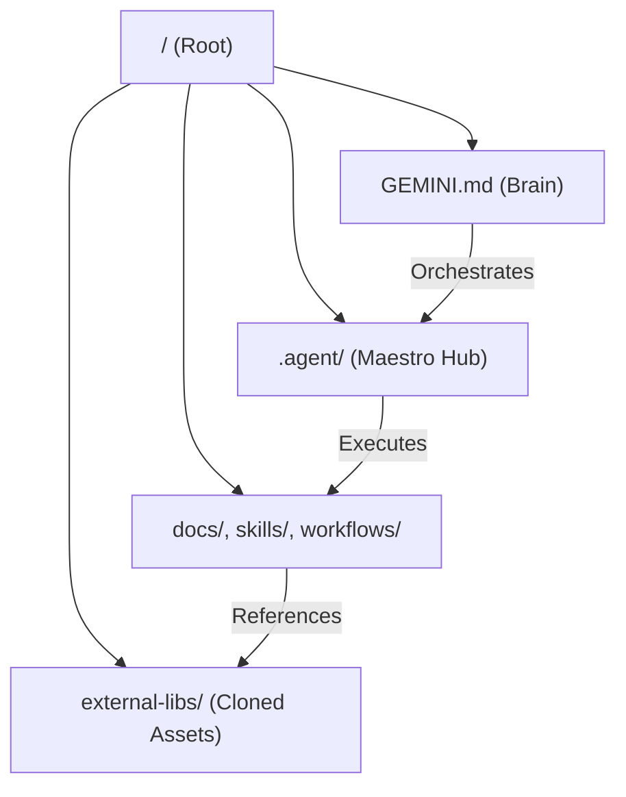

# Architecture Blueprint: Dev Knowledge Base

This document outlines the high-level architecture and organization of the **Dev Knowledge Base** workspace, serving as the system map for AI agents.

## 🏗️ System Overview

The workspace is a massive collection of engineering knowledge, automation tools, and research materials optimized for the **Antigravity AI Coding Assistant**. It follows the **Maestro** orchestration pattern, where centralized rules coordinate specialized resources.

## 📂 Core Components

### 1. The Maestro Hub (`.agent/`)
- **rules/**: Contains 140+ agent personas (e.g., `devops-persona.md`, `CSharpExpert.agent.md`).
- **skills/**: Deep technical primitives for specialized tasks.
- **workflows/**: 200+ executable multi-step procedures (Slash Commands).

### 2. The Knowledge Base
- **skills/**: Central library of reusable technical expertise (Merged Antigravity + Copilot).
- **docs/**: Comprehensive documentation, including AI ecosystem updates and guides.
- **workflows/**: Template workflows and historical procedures.

### 3. External Accelerators (`external-libs/`)
- **antigravity-awesome-skills**: Curated high-performance coding skills.
- **claude-cookbooks**: Official implementation patterns from Anthropic.
- **mcp-servers**: 125+ Model Context Protocol server implementations.

## 🧠 Operational Patterns

1. **Cycle: Plan -> Execute -> Verify**: Every non-trivial action follows this safety-first loop.
2. **Socratic Discovery**: For complex requirements, the system engages in deep discovery before implementation.
3. **Multi-Agent Orchestration**: High-level tasks are broken down and routed to domain-specific agents located in `.agent/rules/`.

## ⚡ Evolution Toolkit (Phase 2)

The workspace includes autonomous maintenance scripts designed to keep the "Gemini Brain" at peak potential:

1.  **[brain_sync.py](file:///d:/my-dev-knowledge-base/scripts/brain_sync.py)**: Synchronizes the `MASTER_KNOWLEDGE_INDEX.md` and `CODEBASE.md` with new files.
2.  **[distill_knowledge.py](file:///d:/my-dev-knowledge-base/scripts/distill_knowledge.py)**: Distills raw library data into structured Knowledge Items (KIs).
3.  **[checklist.py](file:///d:/my-dev-knowledge-base/scripts/checklist.py)**: An advanced auditor that verifies infrastructure and agent hub health.

These protocols ensure the system stays organized as it grows from 85k to 100k+ files.

---
*Last Updated: 2026-02-12*
