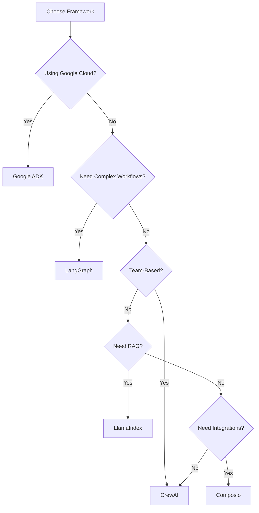

# AI Agent Frameworks - Complete Guide

**Topics**: Multi-Agent Systems, Agent Orchestration, Framework Selection  
**Frameworks Covered**: Google ADK, LangGraph, CrewAI, LlamaIndex, Composio  
**Version**: 1.0  
**Last Updated**: 2026-01-19

---

## Overview

AI agent frameworks enable building sophisticated multi-agent systems that can collaborate, reason, and execute complex workflows. This guide covers the major frameworks available in January 2026.

---

## Framework Comparison

| Framework | Best For | Complexity | Learning Curve | Language Support |
|-----------|----------|------------|----------------|------------------|
| **Google ADK** | Gemini/Vertex AI integration | Medium | Moderate | Python, TypeScript |
| **LangGraph** | Stateful workflows | Medium | Steep | Python |
| **CrewAI** | Role-based teams | Low | Easy | Python |
| **LlamaIndex** | RAG + agents | Medium | Moderate | Python, TypeScript |
| **Composio** | Tool integration | Low | Easy | Python, TypeScript |

---

## 1. Google ADK (Agent Development Kit)

### Overview
Native framework for building Gemini-powered multi-agent systems with minimal code.

### Key Features
- Native Gemini/Vertex AI integration
- Hierarchical agent compositions
- Agent-to-Agent (A2A) protocol support
- Visual agent designer
- Built-in orchestration

### Installation

```bash
pip install google-adk
```

### Quick Start

```python
from google_adk import Agent, AgentTeam

# Define individual agents
researcher = Agent(
    name="Researcher",
    model="gemini-2.0-pro",
    instructions="Research topics thoroughly using web search",
    tools=["web_search", "document_reader"]
)

writer = Agent(
    name="Writer",
    model="gemini-2.0-pro",
    instructions="Create engaging content from research",
    depends_on=[researcher]
)

# Create agent team
content_team = AgentTeam(
    agents=[researcher, writer],
    orchestration="sequential"  # or "parallel", "hierarchical"
)

# Execute
result = content_team.run("Write a blog post about AI agents")
```

### Advanced: Hierarchical Agents

```python
# Manager agent coordinating workers
manager = Agent(
    name="Manager",
    model="gemini-2.0-pro",
    instructions="Coordinate team and delegate tasks",
    role="orchestrator"
)

developers = [
    Agent(name="Frontend Dev", model="gemini-2.0-pro"),
    Agent(name="Backend Dev", model="gemini-2.0-pro"),
    Agent(name="DevOps", model="gemini-2.0-pro")
]

dev_team = AgentTeam(
    manager=manager,
    workers=developers,
    orchestration="hierarchical"
)

result = dev_team.run("Build a user authentication system")
```

### When to Use
- ✅ Using Google Cloud Platform
- ✅ Need native Gemini integration
- ✅ Want visual agent design tools
- ✅ Building enterprise systems

---

## 2. LangGraph

### Overview
Extension of LangChain for building stateful, multi-actor applications with cycles and controllability.

### Key Features
- Stateful graph-based workflows
- Cycle support (agent loops)
- Checkpointing and persistence
- Human-in-the-loop integration
- Time travel debugging

### Installation

```bash
pip install langgraph langchain langchain-google-genai
```

### Quick Start

```python
from langgraph.graph import StateGraph, END
from langchain_google_genai import ChatGoogleGenerativeAI

# Define state
class AgentState(TypedDict):
    messages: list
    research: str
    next: str

# Create graph
workflow = StateGraph(AgentState)

# Add nodes
workflow.add_node("researcher", research_node)
workflow.add_node("writer", writer_node)
workflow.add_node("reviewer", reviewer_node)

# Define edges
workflow.add_edge("researcher", "writer")
workflow.add_edge("writer", "reviewer")
workflow.add_conditional_edges(
    "reviewer",
    should_continue,
    {
        "continue": "writer",
        "end": END
    }
)

# Set entry point
workflow.set_entry_point("researcher")

# Compile
app = workflow.compile()

# Run
result = app.invoke({
    "messages": ["Create a technical blog post on LangGraph"],
    "research": "",
    "next": ""
})
```

### Advanced: Persistent Agents

```python
from langgraph.checkpoint import MemorySaver

# Add persistence
checkpointer = MemorySaver()
app = workflow.compile(checkpointer=checkpointer)

# Run with thread ID for persistence
config = {"configurable": {"thread_id": "user-123"}}
result1 = app.invoke(input1, config)

# Continue from same thread later
result2 = app.invoke(input2, config)  # Remembers previous context


```

### When to Use
- ✅ Need complex, stateful workflows
- ✅ Require loops and cycles
- ✅ Want fine-grained control
- ✅ Building conversational agents

---

## 3. CrewAI

### Overview
Framework for orchestrating role-based AI agents in collaborative teams.

### Key Features
- Simple role-based design
- Pre-built agent templates
- Easy team composition
- Built-in task delegation
- Minimal setup required

### Installation

```bash
pip install crewai
```

### Quick Start

```python
from crewai import Agent, Task, Crew

# Define agents with roles
researcher = Agent(
    role='Research Analyst',
    goal='Find comprehensive information',
    backstory='Expert researcher with attention to detail',
    verbose=True,
    allow_delegation=False
)

writer = Agent(
    role='Content Writer',
    goal='Create engaging articles',
    backstory='Experienced technical writer',
    verbose=True,
    allow_delegation=False
)

# Define tasks
research_task = Task(
    description='Research latest AI agent frameworks',
    agent=researcher,
    expected_output='Detailed research document'
)

writing_task = Task(
    description='Write an article from the research',
    agent=writer,
    expected_output='1000-word article'
)

# Create crew
crew = Crew(
    agents=[researcher, writer],
    tasks=[research_task, writing_task],
    verbose=True
)

# Execute
result = crew.kickoff()
```

### Advanced: Hierarchical Crews

```python
# Manager-led crew
manager = Agent(
    role='Project Manager',
    goal='Coordinate team and ensure quality',
    backstory='Experienced PM with technical background',
    allow_delegation=True
)

crew = Crew(
    agents=[researcher, writer, editor],
    tasks=[research_task, writing_task, editing_task],
    manager_agent=manager,
    process='hierarchical'  # Manager delegates tasks
)
```

### When to Use
- ✅ Simple team-based workflows
- ✅ Role-based task delegation
- ✅ Rapid prototyping
- ✅ Small to medium projects

---

## 4. LlamaIndex

### Overview
Framework for building RAG (Retrieval-Augmented Generation) applications with agent capabilities.

### Key Features
- Advanced RAG pipelines
- Multi-document agents
- Query engines as tools
- Index-based retrieval
- Gemini integration

### Installation

```bash
pip install llama-index llama-index-llms-gemini
```

### Quick Start

```python
from llama_index import VectorStoreIndex, SimpleDirectoryReader
from llama_index.llms import Gemini
from llama_index.agent import ReActAgent

# Load documents
documents = SimpleDirectoryReader('./docs').load_data()

# Create index
index = VectorStoreIndex.from_documents(documents)

# Create query engine tool
query_tool = index.as_query_engine(llm=Gemini())

# Create agent with tools
agent = ReActAgent.from_tools(
    [query_tool],
    llm=Gemini(model="gemini-2.0-pro"),
    verbose=True
)

# Query with context
response = agent.chat("What are the deployment requirements?")
```

### Advanced: Multi-Doc Agent

```python
# Create multiple indexes
docs_index = VectorStoreIndex.from_documents(documentation)
code_index = VectorStoreIndex.from_documents(codebase)
api_index = VectorStoreIndex.from_documents(api_specs)

# Create specialized tools
doc_tool = docs_index.as_query_engine()
code_tool = code_index.as_query_engine()
api_tool = api_index.as_query_engine()

# Multi-tool agent
agent = ReActAgent.from_tools(
    tools=[doc_tool, code_tool, api_tool],
    llm=Gemini(),
    system_prompt="You are a code assistant with access to docs, code, and API specs"
)
```

### When to Use
- ✅ Building RAG applications
- ✅ Need document-based agents
- ✅ Want advanced retrieval
- ✅ Codebase Q&A systems

---

## 5. Composio

### Overview
Universal connector platform for AI agents to interact with 100+ external tools and services.

### Key Features
- 100+ pre-built integrations
- GitHub, Slack, Google Workspace connectors
- Authentication handling
- Webhooks and triggers
- Works with all frameworks

### Installation

```bash
pip install composio-core
```

### Quick Start

```python
from composio import Composio, Action

# Initialize
composio = Comp osio(api_key="your-key")

# Connect to GitHub
github_conn = composio.get_connection("github")

# Use in agent
def code_review_agent(pr_number):
    # Get PR details
    pr = github_conn.execute(
        Action.GITHUB_GET_PR,
       params={"pr_number": pr_number}
    )
    
    # Review code
    review = agent.analyze(pr.code)
    
    # Post comment
    github_conn.execute(
        Action.GITHUB_CREATE_COMMENT,
        params={
            "pr_number": pr_number,
            "body": review
        }
    )
```

### Available Integrations

| Category | Tools |
|----------|-------|
| **Development** | GitHub, GitLab, Bitbucket |
| **Communication** | Slack, Discord, Teams |
| **Productivity** | Gmail, Calendar, Drive |
| **CRM** | Salesforce, HubSpot |
| **Databases** | PostgreSQL, MongoDB |

### When to Use
- ✅ Need external tool integrations
- ✅ Want pre-built connectors
- ✅ Building workflow automation
- ✅ Multi-platform agents

---

##FrameworkComparison Use Cases

### Use Case: Research + Writing Pipeline

**Google ADK**:
```python
team = AgentTeam([researcher, writer], orchestration="sequential")
```

**LangGraph**:
```python
workflow.add_edge("researcher", "writer")
app = workflow.compile()
```

**CrewAI**:
```python
crew = Crew(agents=[researcher, writer], tasks=[research, write])
```

**Recommendation**: CrewAI - Simplest for sequential workflows

---

### Use Case: Customer Support System

**Best Choice**: Composio + LangGraph
- Use Composio for CRM/ticket system integration
- Use LangGraph for stateful conversation management

```python
from langraph import StateGraph
from composio import Composio

# Connect to tools
composio = Composio()
zendesk = composio.get_connection("zendesk")

# Build stateful support agent with LangGraph
workflow = StateGraph(SupportState)
workflow.add_node("ticket_analyzer", analyze_ticket)
workflow.add_node("solution_generator", generate_solution)
# ... compile and run
```

---

## Best Practices

### Framework Selection



### Combining Frameworks

```python
# LangGraph + Composio + LlamaIndex
from langgraph import StateGraph
from composio import Composio
from llama_index import VectorStoreIndex

# RAG tool
index = VectorStoreIndex.from_documents(docs)

# External tools
composio = Composio()

# Stateful workflow
workflow = StateGraph(State)
# Nodes use both RAG and Composio tools
```

---

## Resources

### Official Documentation
- Google ADK: https://cloud.google.com/adk
- LangGraph: https://langchain-ai.github.io/langgraph
- CrewAI: https://docs.crewai.com
- LlamaIndex: https://docs.llamaindex.ai
- Composio: https://docs.composio.dev

### GitHub Repositories
- google-adk: github.com/google/adk
- langgraph: github.com/langchain-ai/langgraph  
- crewai: github.com/joaomdmoura/crewai
- llama_index: github.com/run-llama/llama_index
- composio: github.com/ComposioHQ/composio

---

**Choose the right framework for your needs - build intelligent agent systems!** 🤖
