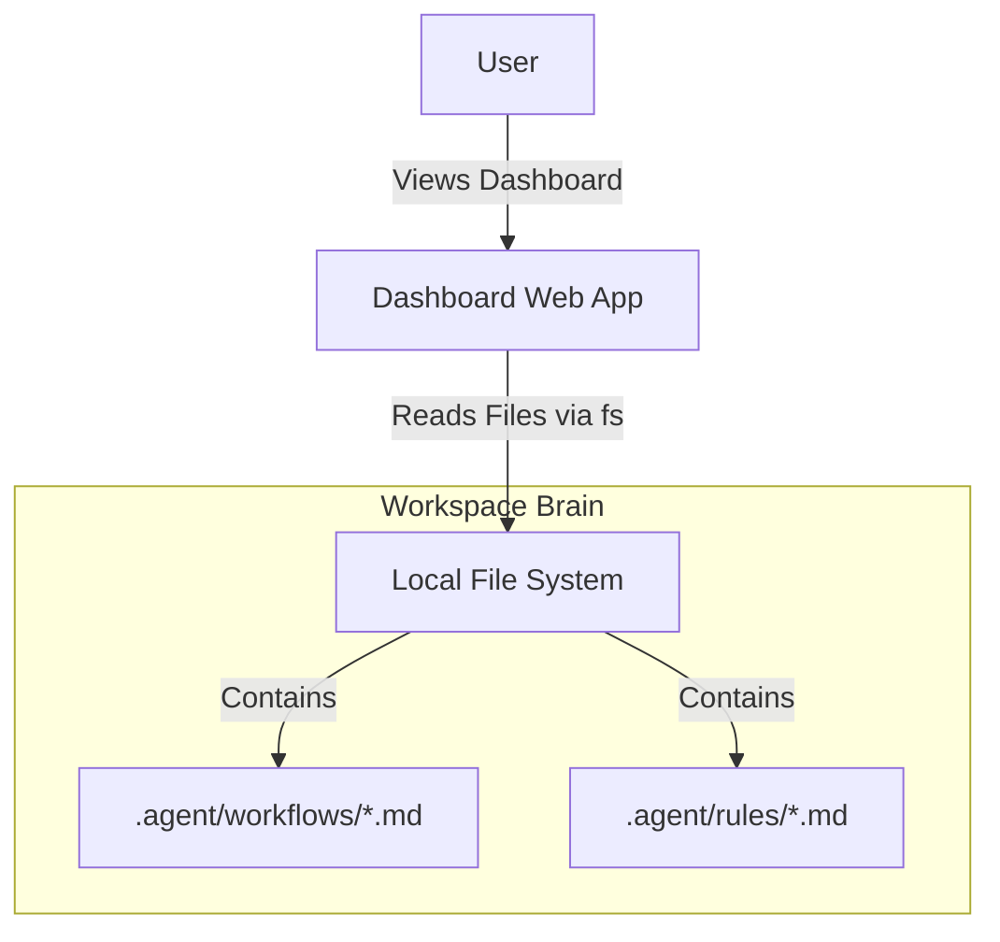

# System Context: Workspace Dashboard

## 1. System Map

## 2. Boundaries

### 2.1. Dashboard Web App (Integration Boundary)
- **Responsibility**: Render UI, handle user navigation, fetch file content.
- **Interface**: Web Browser (HTTP/HTML).

### 2.2. Local File System (External System)
- **Responsibility**: Store the actual markdown files.
- **Access**: Node.js `fs` module.

## 3. Actors
- **Developer/User**: Browses the dashboard to understand available tools.
