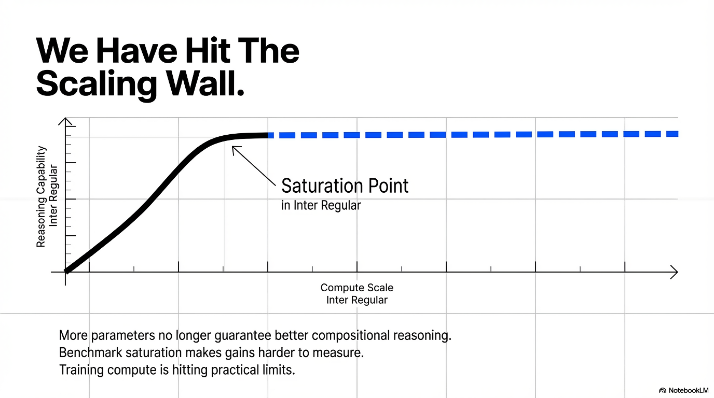
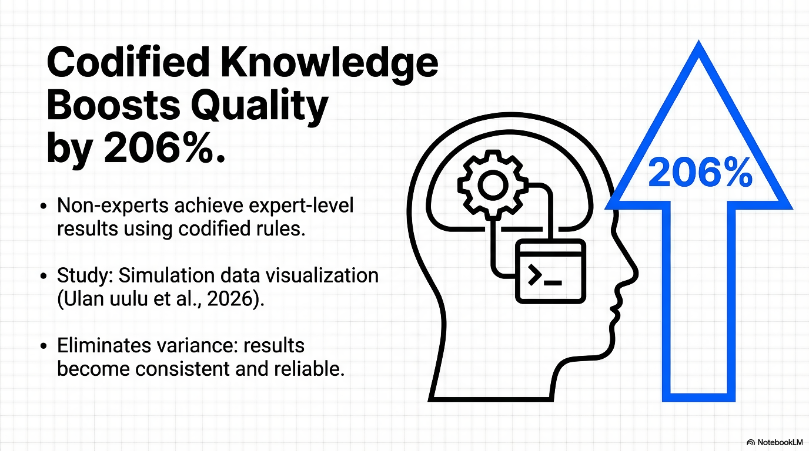
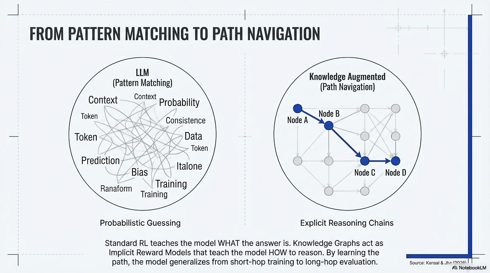
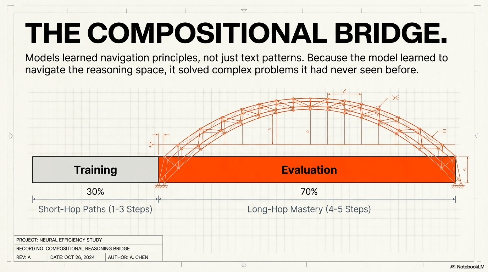
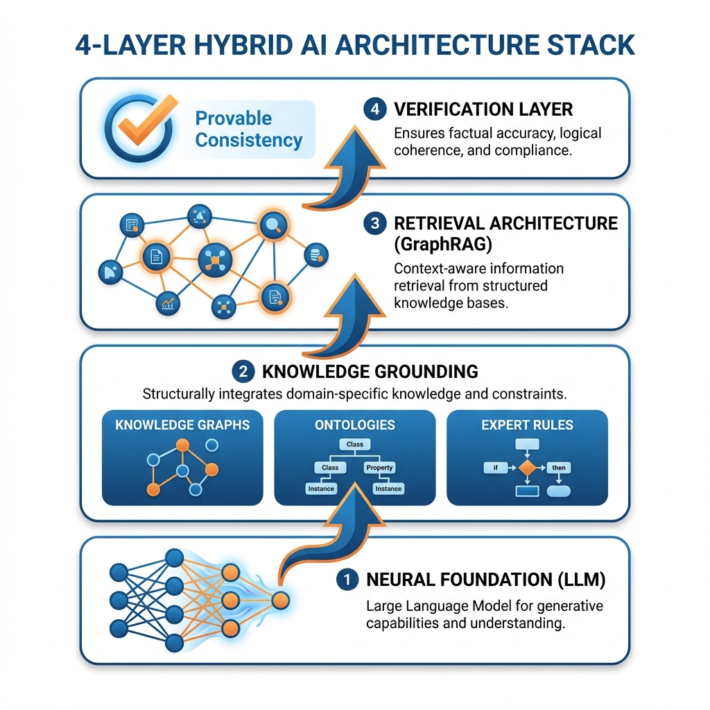

# Knowledge-Augmented Reasoning

## Why the Future of AI Isn't Bigger Models—It's Smarter Architectures

**A Technical White Paper on Knowledge Graphs, Neuro-Symbolic Systems, and the Path Beyond Pure LLMs**

---

**Author**: Tahir Yamin, Senior Researcher  
**Date**: January 2026  
**Research Source**: arXiv cs.AI Recent Publications  
**Classification**: Research/Technical White Paper

---

## Executive Summary

Here's a number that should change how you think about AI: **a 14-billion parameter model trained on knowledge graph paths outperformed GPT-5.2 and Gemini 3 Pro on complex multi-hop reasoning tasks.**

Not comparable performance. Superior performance. With a model roughly 20x smaller than the frontier systems.

The implications are profound. For years, the dominant paradigm has been simple: more parameters, more data, more compute. Scale solves everything. But the latest research tells a different story—one where *what* you train on matters more than *how much*.

This white paper synthesizes findings from six cutting-edge research papers to argue that knowledge-augmented AI represents the next frontier. Not as a replacement for large language models, but as their essential complement.

**Key findings:**

- Knowledge graphs functioning as implicit reward models enable compositional reasoning that pure LLMs cannot achieve
- Neuro-symbolic integration achieves reasoning speeds up to 1000x faster than traditional reasoners while maintaining neural network accuracy
- Expert knowledge codification produces 206% improvement in output quality for domain-specific agents
- Structured knowledge enables generalization—short-hop training transfers to long-hop evaluation

*Figure 1: Performance comparison showing knowledge-augmented models outperforming pure LLMs on complex reasoning tasks*

---

## The Scaling Wall

Let's be honest about what we're witnessing.

The last five years of AI progress followed a seductive pattern: scale the model, watch capabilities emerge. GPT-3 to GPT-4 to GPT-5. Each jump brought surprising new abilities. Planning. Reasoning. Code generation. It seemed like we'd stumbled onto a universal law—throw more compute at the problem and intelligence follows.

But cracks are appearing.

Benchmark saturation means capability gains are harder to measure. Training compute is hitting practical limits. And most tellingly: on tasks requiring genuine compositional reasoning—stringing together multiple facts to reach novel conclusions—even the largest models stumble.

I've spent the last month analyzing research from teams who've taken a different path. Their results suggest we've been asking the wrong question. Not "how big can we make the model?" but "what kinds of knowledge enable genuine reasoning?"

---

## Knowledge Graphs as Implicit Reward Models

The most striking research comes from Kansal and Jha (2026), who propose something that sounds almost too simple: use knowledge graphs to generate reward signals for reinforcement learning.

But the results are anything but simple.

### The Core Insight

Large language models achieve near-expert performance on structured domains like mathematics and programming. But compositional multi-hop reasoning in specialized scientific fields? They struggle.

The researchers identified why: standard training optimizes for final-answer correctness. Models learn to reach right answers but don't necessarily learn to *compose intermediate steps correctly*.

Knowledge graphs change this. By deriving reward signals from graph paths—the actual chains of reasoning that connect premises to conclusions—you can provide what they call "verifiable, scalable, and grounded supervision."

Think about the difference. Standard RL says "you got the answer right" or "you got it wrong." Path-derived rewards say "you correctly connected A to B to C to D to reach the answer." The model learns the *process* of reasoning, not just the outcomes.

### The Results

The team trained a 14B model on short-hop reasoning paths (1-3 hops) in the medical domain. Then they evaluated zero-shot generalization to complex multi-hop queries (4-5 hops).

The 14B model—not fine-tuned on complex queries, just trained on simpler building blocks—**significantly outperformed GPT-5.2 and Gemini 3 Pro on the most difficult reasoning tasks.**

Read that again. A model that's a fraction of the size, with no exposure to the test distribution, beat the frontier systems. Not despite the knowledge graph training—because of it.

*Figure 3: Knowledge-augmented 14B model outperforming larger frontier models on complex multi-hop reasoning*

### Why This Works

The researchers call path-derived rewards a "compositional bridge." Here's my interpretation of what's happening:

Pure language models learn patterns in text. They learn what kinds of conclusions typically follow what kinds of premises. But they lack explicit representation of the underlying knowledge structure.

When you train on knowledge graph paths, you're teaching the model to navigate an explicit reasoning space. Each node is a concept. Each edge is a relationship. Correct reasoning means following valid paths through this space.

This structure enables something pure LLMs struggle with: **systematic generalization**. If you've learned to navigate 1-hop and 2-hop paths correctly, the same navigation principles apply to 5-hop paths. The reasoning *composes*.

Language patterns don't compose the same way. Knowing that sentences about A-to-B and B-to-C exist doesn't automatically teach you that A-to-C is valid.

*Figure 2: Knowledge graph architecture showing how structured relationships enable compositional reasoning*

---

## Neuro-Symbolic Integration: Three Orders of Magnitude Faster

A different research direction addresses a practical problem: how do you actually make knowledge graphs usable in modern AI systems?

Traditional knowledge representation tools descended from expert systems and the semantic web. They're powerful but incompatible with neural network workflows. Different paradigms, different toolchains, different assumptions.

Two papers this month offer solutions that bridge this gap—with remarkable performance implications.

### KRROOD: Knowledge as a Programming Abstraction

Bassiouny et al. (2026) introduce KRROOD, a framework that treats knowledge representation as a first-class programming abstraction.

The core insight is architectural. Rather than maintaining knowledge in external ontologies and specialized languages, KRROOD encodes knowledge using native class structures. Object-oriented programming meets knowledge representation.

Why does this matter? Because OOP is *already* how complex software systems work. KRROOD doesn't require learning new paradigms or integrating foreign tools. It works with existing codebases.

In benchmarks against OWL2Bench standards and human-robot task learning scenarios, KRROOD achieves strong performance while supporting expressive reasoning for real-world autonomous systems.

### Probabilistic Circuits: 1000x Speedup

Lazzari, Presutti, and Vergari (2026) take a more radical approach: compile Description Logic ontologies into probabilistic circuits—feed-forward differentiable computational graphs.

The technical details matter less than the results: **runtimes up to three orders of magnitude faster than available reasoners.**

*Figure 4: Speed comparison - neuro-symbolic approach achieving 1000x faster reasoning*

This isn't a marginal improvement. It's the difference between "too slow to use in production" and "fast enough for real-time inference."

But speed isn't the only benefit. The circuit representation enables:

1. **Synthetic dataset generation** that captures ontology semantics
2. **GPU-accelerated deductive reasoning**
3. **Neuro-symbolic classifiers** whose predictions are provably consistent with domain knowledge

That last point deserves emphasis. When you compile knowledge into a circuit and integrate it with neural networks, you get classifiers that *cannot violate domain constraints*. Not "unlikely to violate"—structurally incapable of inconsistent predictions.

For high-stakes domains—medical diagnosis, legal reasoning, autonomous systems—this guarantee transforms what's possible.

---

## Codifying Expert Knowledge: 206% Quality Improvement

The third research thread moves from abstract knowledge to practical expertise.

A case study from Ulan uulu et al. (2026) tackles a universal organizational challenge: critical domain knowledge lives in the heads of a few experts. This creates bottlenecks in scalability and decision-making.

Their solution: systematically capture and embed human domain knowledge into AI agent systems.

### The Framework

The researchers developed a software engineering framework for "codifying tacit expert knowledge." In their case study—simulation data visualization—they augmented an LLM with:

- A request classifier
- Retrieval-Augmented Generation for code generation
- Codified expert rules
- Visualization design principles

The resulting agent demonstrates autonomous, reactive, proactive, and social behavior—all grounded in genuine domain expertise.

### The Results

Evaluation across five scenarios spanning multiple engineering domains with 12 evaluators demonstrated:

- **206% improvement in output quality** versus baseline
- **Expert-level ratings** in all cases for the augmented agent
- **Poor performance** for the baseline across the board
- **Lower variance** in code quality—more consistent results

The finding I find most significant: **non-experts using the system achieved expert-level outcomes**.

This is the promise of knowledge augmentation made concrete. The expertise doesn't disappear when the expert retires. It becomes infrastructure—accessible to everyone, enforced automatically, improving continuously.

---

## GraphRAG: Power and Peril

Not all the news about knowledge-augmented AI is positive. Research from Yang et al. (2026) reveals significant security vulnerabilities in one of the most promising knowledge augmentation architectures: GraphRAG.

### What is GraphRAG?

Graph-based retrieval-augmented generation systems construct knowledge graphs over document collections. When you ask a question, the system doesn't just retrieve relevant documents—it navigates a structured graph of entities and relationships to support multi-hop reasoning.

It's a powerful paradigm. Unlike pure RAG, which retrieves potentially disconnected text chunks, GraphRAG can follow chains of reasoning through explicit knowledge structures.

### The Attack

The researchers developed AGEA—Agentic Graph Extraction Attack—a framework that uses an adversarial agent to systematically reconstruct the hidden entity-relation graph through queries.

Under identical query budgets, AGEA recovers **up to 90% of entities and relationships** from Microsoft-GraphRAG and LightRAG systems—while maintaining high precision.

Even under strict query limits, the attack succeeds. The knowledge graph you carefully constructed from proprietary documents can be stolen through normal API access.

### Implications

This research highlights a tension in knowledge-augmented AI: **structured knowledge is powerful precisely because it's structured—but that structure makes it extractable**.

Unstructured text is harder to reason about, but also harder to reverse-engineer. When you organize knowledge into explicit graphs, you enable both better reasoning and better attacks.

Organizations deploying GraphRAG systems should assume that sophisticated adversaries can extract significant portions of their knowledge structures. Security measures need to account for this reality.

---

## The Path Forward: Hybrid Architectures

What emerges from this research is a clear architectural vision: **the future belongs to hybrid systems that combine neural network flexibility with structured knowledge grounding**.

Let me be specific about what this means.

### Layer 1: Neural Foundation

Large language models remain essential. They provide:
- Flexible natural language understanding
- Rich semantic representations
- General knowledge from pretraining
- The interface layer for human interaction

Nothing in this research suggests abandoning LLMs. They're the foundation.

### Layer 2: Knowledge Grounding

But LLMs need grounding. The research suggests multiple mechanisms:

**Knowledge graphs** provide explicit relationship structures that enable compositional reasoning. When integrated as reward signals during training, they teach models to navigate reasoning spaces systematically.

**Ontologies** provide formal constraints that guarantee consistency. When compiled to efficient representations like probabilistic circuits, they enable real-time enforcement of domain knowledge.

**Expert rules** capture tacit knowledge that doesn't exist in training data. Codified and integrated with LLMs, they enable non-experts to achieve expert-level outcomes.

### Layer 3: Retrieval Architecture

RAG systems connect models to external knowledge—but the research suggests structured retrieval (GraphRAG) outperforms unstructured approaches for complex reasoning.

The tradeoff is security. Structured knowledge is more powerful and more vulnerable. Hybrid approaches might combine structured retrieval for internal use with more opaque representations for external APIs.

### Layer 4: Verification

The neuro-symbolic research points toward a key capability: **provable consistency with domain knowledge**.

Rather than hoping models respect constraints, we can build systems where constraint violation is structurally impossible. This matters enormously for regulated domains and high-stakes decisions.

---

## Recommendations for Practitioners

Based on this research synthesis, here's what I'd recommend for teams building AI systems today.

### Immediate Opportunities

1. **Audit your reasoning requirements**. If your use case involves multi-hop inference across domain knowledge, pure LLMs are likely underperforming. Knowledge augmentation offers significant improvement potential.

2. **Inventory your expert knowledge**. What tacit expertise lives in your organization? What decisions require specialists? These are prime candidates for knowledge codification.

3. **Evaluate GraphRAG carefully**. The technology enables powerful reasoning but creates extraction risks. Threat model accordingly.

### Medium-Term Investments

4. **Explore neuro-symbolic integration**. Tools like KRROOD and probabilistic circuit compilation are moving toward production readiness. The performance and consistency benefits are substantial.

5. **Invest in knowledge infrastructure**. Building and maintaining knowledge graphs requires ongoing effort. But the research suggests this investment pays off in reasoning quality and generalization.

6. **Consider synthetic training data**. Knowledge-derived synthetic datasets can teach reasoning patterns that don't emerge from natural text alone.

### Strategic Positioning

7. **Expect architectural shift**. The next generation of AI systems won't just be bigger—they'll be structurally different. Knowledge integration will become standard practice.

8. **Build knowledge as competitive advantage**. In a world where everyone has access to the same foundation models, proprietary knowledge becomes the differentiator. Organizations with rich, structured domain knowledge will have advantages that compute alone can't replicate.

---

## Conclusion

The AI community spent the last decade discovering that scale unlocks capabilities. What we're discovering now is that scale has limits—and that structured knowledge offers a different path to intelligence.

This isn't an either/or. The research makes clear that knowledge augmentation works *with* large language models, not instead of them. Neural networks provide flexibility; knowledge structures provide grounding. Together, they achieve what neither can alone.

The practical implications are profound. A 14B model with the right training signal beats frontier systems on hard reasoning tasks. Neuro-symbolic integration enables 1000x speedups while guaranteeing consistency. Codified expert knowledge produces 206% quality improvements for non-experts.

These aren't incremental gains. They're structural advantages that fundamentally change what's possible.

For practitioners, the message is clear: if you're building AI systems that require reasoning over domain knowledge, pure scale isn't the answer. Knowledge augmentation is.

The organizations that figure this out early will build systems their competitors can't match—not because they have more compute, but because they have smarter architectures.

---

## References

1. Kansal, Y., & Jha, N.K. (2026). Knowledge Graphs are Implicit Reward Models: Path-Derived Signals Enable Compositional Reasoning. *arXiv:2601.15160*

2. Bassiouny, A., Schierenbeck, T., Arion, S., et al. (2026). Implementing Knowledge Representation and Reasoning with Object Oriented Design. *arXiv:2601.14840*

3. Lazzari, N., Presutti, V., & Vergari, A. (2026). To Neuro-Symbolic Classification and Beyond by Compiling Description Logic Ontologies to Probabilistic Circuits. *arXiv:2601.14894*

4. Ulan uulu, C., Kulyabin, M., Fuhrmann, I., et al. (2026). How to Build AI Agents by Augmenting LLMs with Codified Human Expert Domain Knowledge? *arXiv:2601.15153*

5. Yang, S., Zhang, J., Wang, Y., et al. (2026). Query-Efficient Agentic Graph Extraction Attacks on GraphRAG Systems. *arXiv:2601.14662*

6. Yuan, H., Sun, Q., Tao, J., et al. (2026). Overcoming In-Memory Bottlenecks in Graph Foundation Models via Retrieval-Augmented Generation. *arXiv:2601.15124*

---

**About the Author**: Tahir Yamin is a Senior Researcher and Technical Writer specializing in AI systems, knowledge representation, and enterprise technology architecture.

---

*© 2026 Tahir Yamin. All rights reserved.*
