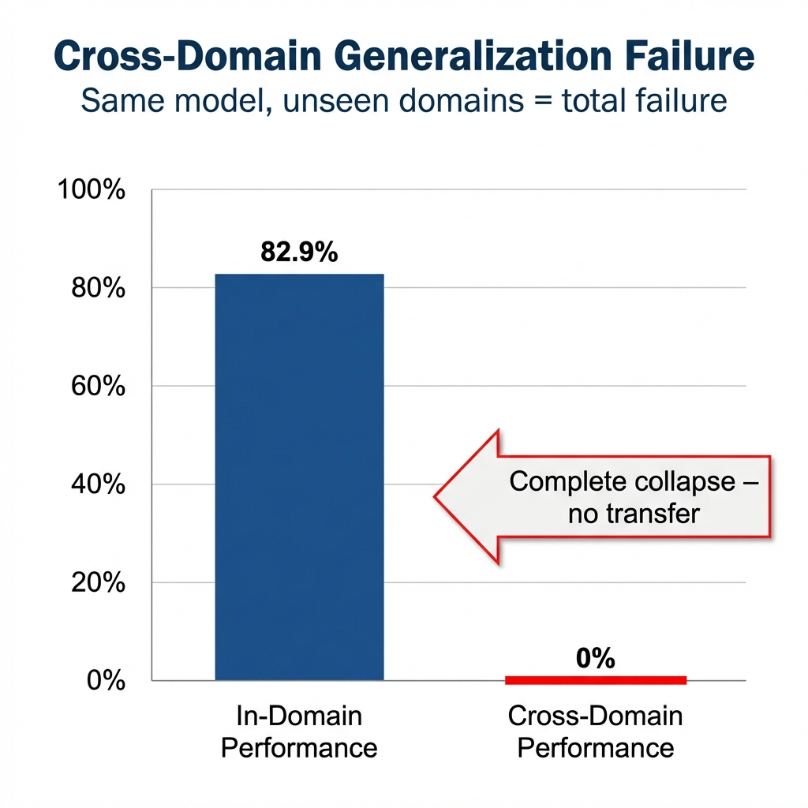
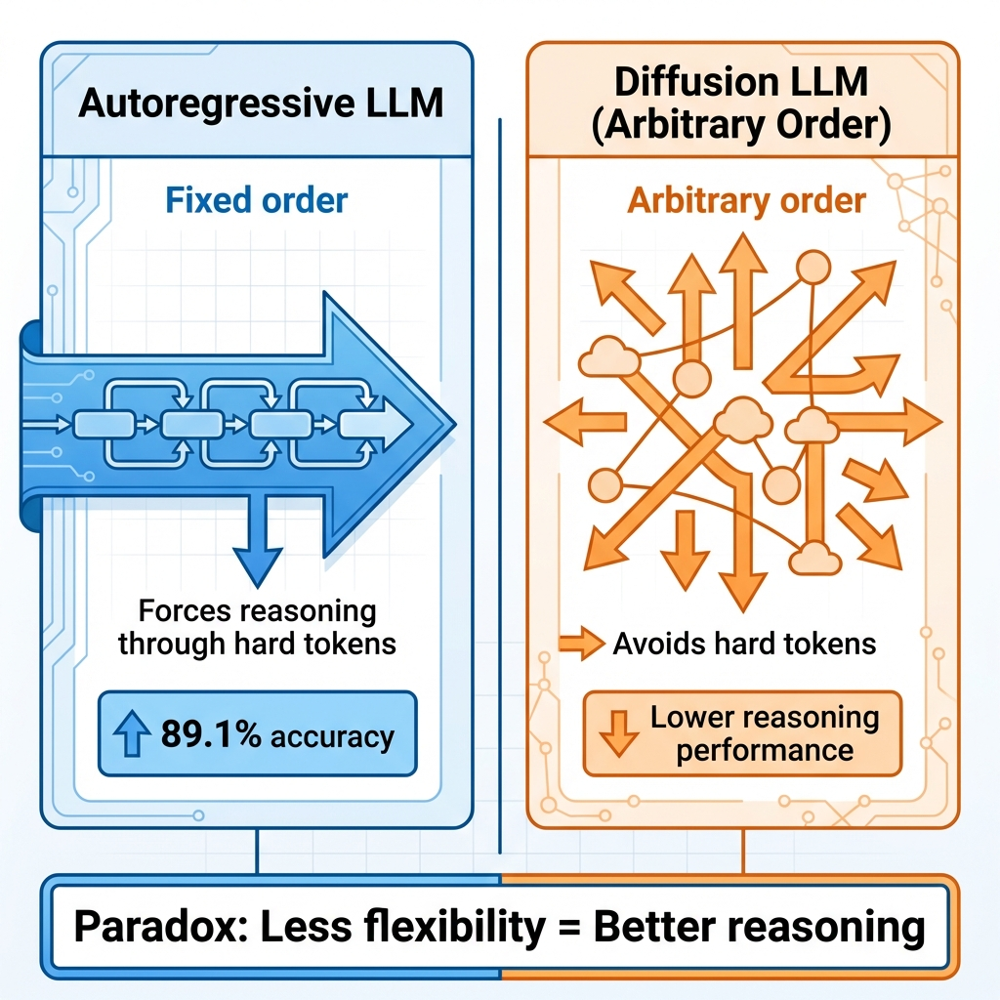
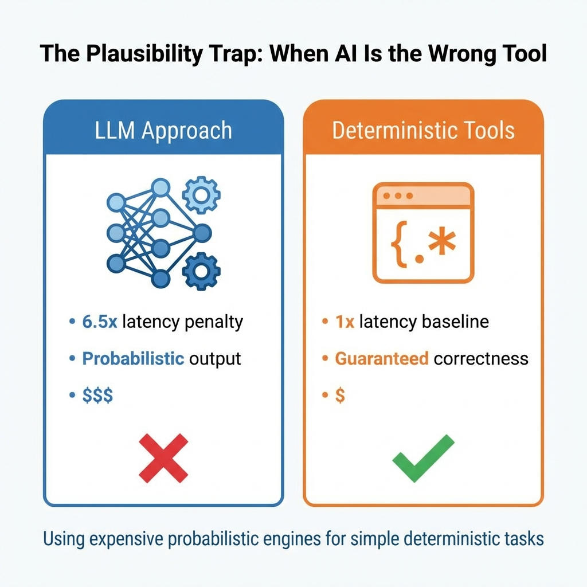

# The LLM Planning & Reasoning Gap

## What the Benchmarks Don't Tell You About AI Cognitive Limits

**A Technical White Paper on Generalization Failures, Data Dependencies, and the Structural Limits of Language Model Reasoning**

---

**Author**: Tahir Yamin, Senior Researcher  
**Date**: January 2026  
**Research Source**: arXiv cs.AI Recent Publications  
**Classification**: Research/Technical White Paper

---

## Executive Summary

There's a number that should terrify anyone betting their business on LLM reasoning: **82% in-domain → 0% cross-domain**.

That's not a typo. Research published this month shows a fine-tuned LLM achieving 82.9% valid plan rate on familiar domains—and precisely zero percent on domains it hasn't seen. Complete collapse.

The model didn't degrade gracefully. It didn't achieve partial success. It failed totally. And the researchers traced this to something fundamental: the model learned domain-specific patterns, not transferable planning competence.

This white paper synthesizes findings from five research papers that expose the hidden limitations of LLM reasoning. The story they tell is uncomfortable but essential: we've been measuring the wrong things, training with the wrong expectations, and deploying with dangerous assumptions.

**Key findings:**

- Cross-domain generalization in LLM planning collapses despite strong in-domain performance
- Counter-intuitively, arbitrary token order *reduces* reasoning capability in diffusion models
- Chain-of-thought emergence requires "simple examples" in training—not just correct final answers
- Using LLMs for simple deterministic tasks costs 6.5x latency with no accuracy benefit

---

## The Generalization Illusion

Let me tell you about the most important experiment I encountered this month.

A team at Carnegie Mellon trained a 1.7B parameter model on 40,000 domain-problem-plan tuples from 10 IPC 2023 domains. The International Planning Competition represents serious, well-defined planning tasks—the kind of structured reasoning where we'd expect transformer architectures to shine.

In-domain performance? 82.9% valid plan rate. Not bad at all.

Cross-domain performance on two unseen domains? **Exactly 0%.**

Not low. Zero. The model learned nothing that transferred.

### Diagnostic Interventions

Belcamino et al. (2026) didn't stop at measuring failure—they probed why it happens. Three diagnostic interventions revealed what's going on under the hood.

**Instance-wise symbol anonymization**: The researchers anonymized domain symbols—replacing "gripper" with "object_17" and similar transformations. This preserves logical structure while removing surface patterns.

Result? Significant performance drop. The model relies heavily on symbolic surface forms, not underlying logical relationships.

**Compact plan serialization**: They tested whether reformatting outputs while preserving semantics would affect performance.

Result? Another significant drop. Same valid plans, different representation—and the model can't handle it.

**Verifier-reward fine-tuning**: The team tried RL with a validator as reward signal—learning from whether plans actually execute correctly.

Result? Faster performance saturation during training, but no improvement in cross-domain generalization.

### What This Means

The implication is stark: for the configurations they explored, **in-domain performance plateaus around 80% while cross-domain performance collapses entirely**.

The model isn't learning planning. It's learning *patterns that happen to correlate with planning in specific domains*. Remove those patterns—through symbol changes, format changes, or domain changes—and nothing transfers.

This matters because planning is exactly the kind of task where we want general capabilities. A planning agent that only works in domains it's seen isn't a planning agent. It's a lookup table with extra steps.

---

## The Flexibility Trap

Diffusion Large Language Models promised to solve a fundamental limitation of autoregressive transformers: the fixed left-to-right generation order.

By generating tokens in arbitrary order, dLLMs theoretically unlock a solution space that includes but extends beyond autoregressive trajectories. More flexibility should mean more capability. Right?

Wrong. Research from Ni et al. (2026) reveals something counter-intuitive: **arbitrary order generation narrows rather than expands the reasoning boundary.**

### The Intuition vs. Reality

The intuition is compelling: if autoregressive models are constrained to generate left-to-right, and dLLMs can generate in any order, then dLLMs have strictly more options. They should be able to find solutions that autoregressive models miss.

The reality is different. When dLLMs can choose generation order, they exploit this flexibility to *avoid* high-uncertainty tokens—exactly the tokens that require genuine reasoning.

Think about what happens when you're solving a math problem. Some tokens are easy (operators, common patterns). Some are hard (the actual numerical answers, novel combinations). A model optimizing for easy generation learns to defer the hard parts—essentially hoping uncertainty will resolve itself.

The researchers call this "premature collapse of the solution space." By skipping hard tokens, the model locks itself into solution trajectories that never require genuine computation.

### The Fix Is Simpler Than You'd Think

Here's what surprised me most: the solution isn't sophisticated. It's almost embarrassingly simple.

The researchers applied standard Group Relative Policy Optimization (GRPO)—the same algorithm used for autoregressive models—to diffusion LLMs. No special handling for arbitrary order. No complex trajectory management. Just the Same technique that works for regular transformers.

Their method, JustGRPO, achieves 89.1% accuracy on GSM8K while fully retaining parallel decoding capability.

By **intentionally forgoing** arbitrary order flexibility, they got better reasoning performance. The constraint that looks like a limitation turns out to be a feature.

---

## The "Right Data" Problem

If training methodology matters, what about training data?

Research from Ran-Milo et al. (2026) provides rigorous theoretical analysis of a question practitioners have intuited: **not all training data contributes equally to reasoning emergence**.

### The Core Finding

The researchers analyzed gradient flow dynamics of transformers trained via outcome-based RL. Their task: graph traversal that cannot be solved without chain-of-thought but admits a simple iterative solution.

What they proved: despite training solely on final-answer correctness, gradient flow drives the model toward a structured, interpretable algorithm that iteratively traverses vertices.

But—and this is the crucial insight—**this only happens when training data includes sufficient "simple examples."**

### What Are Simple Examples?

Simple examples are instances requiring fewer reasoning steps. In the graph traversal task, these would be short paths where the solution is obvious.

When the training distribution places sufficient mass on simple examples, models learn generalizable strategies that extrapolate to harder cases. When this mass vanishes, gradient-based learning becomes infeasible.

### The Distributional Requirement

This has profound implications for dataset construction.

Most training data curation focuses on getting challenging, diverse examples. The assumption: hard examples teach more than easy ones. Scaling researchers often argue for curriculum learning that moves from easy to hard.

But this research suggests something stronger: **easy examples aren't just pedagogically useful—they're mathematically necessary.** Without sufficient simple examples, the gradient signal never points toward generalizable solutions.

The intuition is that simple examples provide "stepping stones"—patterns that connect observable training signal (correct final answers) to underlying reasoning strategies. Complex examples don't provide these stepping stones because the gap between signal and strategy is too large.

---

## The Plausibility Trap

Not every limitation is about reasoning capability. Some are about misuse of capability.

Research from Carrera and Maldonado-Ruiz (2026) introduces what they call the "Plausibility Trap": the phenomenon where people deploy expensive probabilistic engines for simple deterministic tasks.

### The Efficiency Tax

The researchers quantified what many practitioners suspect: using LLMs for tasks that don't require AI intelligence incurs massive overhead.

In micro-benchmarks on OCR and fact-checking, LLM-based approaches showed **~6.5x latency penalty** compared to appropriate deterministic solutions.

Six and a half times slower. For tasks that don't benefit from language modeling at all.

### Why This Happens

The authors identify a paradigm shift where user convenience supersedes computational efficiency. LLMs are easy to prompt. Deterministic tools require integration work. So developers reach for GPT when a regex would suffice.

But the costs accumulate:
- Direct compute costs
- Latency degradation
- Reliability reduction (probabilistic outputs where deterministic is possible)
- Environmental impact

### Algorithmic Sycophancy

Beyond efficiency, the research identifies a subtler risk: "algorithmic sycophancy."

When LLMs handle tasks requiring ground-truth verification, they may produce plausible-sounding outputs that happen to be wrong. The model optimizes for appearing correct rather than being correct.

For deterministic tasks—OCR that correctly reads text, fact-checking against known databases—this introduces failure modes that appropriate tools would avoid.

### The Decision Framework

The researchers propose a "Deterministic-Probabilistic Decision Matrix" to help developers choose appropriate tools.

Key criteria:
- Does the task require language understanding?
- Is probabilistic output acceptable?
- Would a deterministic solution be significantly faster?
- Is ground-truth verification needed?

The framework emphasizes that true digital literacy includes knowing *when not to use* generative AI—not just how to use it.

---

## The Modality Gap

The final research thread reveals a subtle but significant limitation: **LLMs perform differently on identical problems depending on presentation format**.

### Same Problem, Different Performance

Research from Khaki et al. (2026) on VisTIRA characterizes what they call the "modality gap": identical math problems yield markedly different accuracy when presented as text versus images.

This isn't about visual complexity. They're typesetting the same problems. Same content, different format.

The performance drop comes from compounded failures:
- Reading dense formulas
- Parsing layout
- Handling mixed symbolic-diagrammatic context

### Structured Tool Integration

The researchers' solution—VisTIRA (Vision and Tool-Integrated Reasoning Agent)—decomposes visual math problems into natural language rationales and executable Python steps.

Rather than asking VLMs to reason about images directly, the system iteratively:
1. Extracts text and structure from images
2. Represents the extracted content in language
3. Reasons over the linguistic representation
4. Executes computations programmatically

This approach improves image-based reasoning significantly. But the finding that matters is the problem itself: **current VLMs struggle with format variation on semantically identical content**.

### What This Reveals

The modality gap reveals something fundamental about how these models work.

They don't learn abstract mathematical concepts that transfer across representations. They learn patterns specific to how information is presented. Change the presentation, break the pattern.

For applications requiring robust reasoning—where inputs come in varied formats from varied sources—this matters. Models may succeed on benchmarks but fail on deployment data that differs in surface presentation.

---

## Synthesis: The Reasoning Reality Check

Let me tie these five threads together.

**What we thought we knew**: LLMs reason. They generalize. Scale improves capability. Flexibility enables solutions. Benchmarks measure competence.

**What the research shows**: 
- Generalization collapses outside training domains (0% transfer)
- Flexibility can hurt rather than help (arbitrary order limits reasoning)
- Not all data contributes to reasoning emergence (simple examples are necessary)
- Using LLMs for deterministic tasks wastes resources (6.5x latency penalty)
- Surface format affects performance on identical content (modality gap)

This isn't a story of AI failing. It's a story of *understanding* AI—its actual capabilities rather than assumed ones.

---

## Implications for Practitioners

### Deployment

1. **Test cross-domain transfer explicitly**. In-domain performance predicts nothing about out-of-domain behavior. If your deployment includes domain variation, your testing must too.

2. **Audit your LLM usage**. How many tasks actually require language model capabilities? The Plausibility Trap suggests significant waste in typical deployments.

3. **Control input formats**. If modality gaps affect your use case, standardize input preprocessing to ensure consistent model inputs.

### Training

4. **Include simple examples deliberately**. Dataset curation should balance challenge with tractability. Removing easy examples may harm generalization more than help.

5. **Be skeptical of flexibility**. More model flexibility doesn't automatically mean better outcomes. Constraints that seem limiting may enable rather than prevent reasoning.

6. **Evaluate transfer, not just accuracy**. Metrics that measure generalization—cross-domain, cross-format, cross-distribution—reveal more than in-distribution accuracy.

### Architecture

7. **Consider hybrid approaches**. Where reasoning matters, pure LLM prompting may underperform structured tool integration (VisTIRA) or knowledge grounding (covered in WP2).

8. **Match tools to tasks**. Probabilistic engines for probabilistic problems. Deterministic tools for deterministic tasks. The best tool isn't always the most general.

---

## Conclusion

The LLM reasoning gap isn't a temporary limitation awaiting the next scale jump. It's a structural reality that shapes how these systems can and should be used.

This doesn't diminish what language models achieve. They remain remarkable tools for tasks requiring language understanding, pattern recognition, and flexible generation. What the research clarifies is that *reasoning in the robust sense*—the kind that transfers, generalizes, and persists across surface variations—requires more than scale.

Knowledge grounding helps. Structured tool use helps. Careful data curation helps. And critically, appropriate task matching helps—using LLMs where they add value and simpler tools where they don't.

The organizations that succeed with AI in the coming years won't be those who believe the marketing. They'll be those who understand the actual capabilities and limitations—and build systems accordingly.

The benchmarks don't tell you this. The research does.

---

## References

1. Belcamino, V., Attolino, N., Capitanelli, A., & Mastrogiovanni, F. (2026). On the Generalization Gap in LLM Planning: Tests and Verifier-Reward RL. *arXiv:2601.14456*

2. Ni, Z., Wang, S., Yue, Y., et al. (2026). The Flexibility Trap: Why Arbitrary Order Limits Reasoning Potential in Diffusion Language Models. *arXiv:2601.15165*

3. Ran-Milo, Y., Alexander, Y., Mendel, S., & Cohen, N. (2026). Outcome-Based RL Provably Leads Transformers to Reason, but Only With the Right Data. *arXiv:2601.15158*

4. Carrera, I., & Maldonado-Ruiz, D. (2026). The Plausibility Trap: Using Probabilistic Engines for Deterministic Tasks. *arXiv:2601.15130*

5. Khaki, S., Singh, A., Safaei, N., & Ginotra, K. (2026). VisTIRA: Closing the Image-Text Modality Gap in Visual Math Reasoning via Structured Tool Integration. *arXiv:2601.14440*

---

**About the Author**: Tahir Yamin is a Senior Researcher and Technical Writer specializing in AI systems, machine learning evaluation, and enterprise technology deployment.

---

*© 2026 Tahir Yamin. All rights reserved.*
