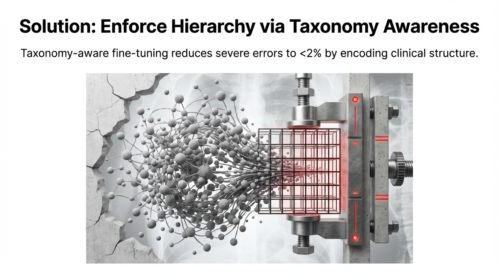
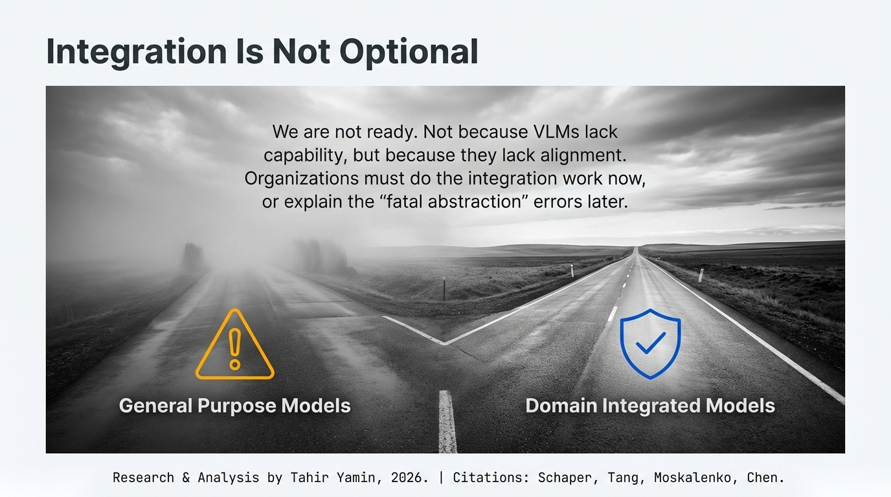

# Vision-Language Models in Safety-Critical Domains

## The Gap Between Perception and Safe Decision-Making

**A Technical White Paper on Medical AI Alignment, Autonomous Driving Benchmarks, and the Limits of Visual Understanding**

---

**Author**: Tahir Yamin, Senior Researcher  
**Date**: January 2026  
**Research Source**: arXiv cs.AI Recent Publications  
**Classification**: Research/Technical White Paper

---

## Executive Summary

Vision-language models are entering domains where mistakes kill people. And the latest research reveals something troubling: **high benchmark accuracy hides systematic misalignment with domain requirements**.

A VLM can achieve impressive accuracy on chest X-ray classification while making errors that distinguish between "annoying" and "fatal." Standard metrics treat these equivalently. They shouldn't.

This white paper synthesizes five research papers examining VLMs in safety-critical applications—medical diagnosis and autonomous driving. The pattern is consistent: perception capabilities don't translate automatically to safe decision-making. Something more is needed.

**Key findings:**

- VLMs show substantial misalignment with clinical taxonomies despite high flat performance
- Perception and decision-making performance correlate weakly in autonomous driving tasks
- Promptable segmentation models are highly sensitive to natural input variations
- Automated evaluation rubrics outperform LLM baselines on clinical accuracy assessment

---

## Medical AI: When Accuracy Isn't Enough

The promise of AI in medicine is enormous. Radiologists are overwhelmed. Diagnostic errors cause preventable deaths. Automated systems could process images faster, more consistently, and at scale.

Vision-language models seem ideally suited. They understand both images and language. They can explain their reasoning. They achieve impressive benchmark scores.

But research from Schaper et al. (2026) reveals a critical problem: **standard metrics fail to distinguish between clinically minor and catastrophic errors**.

### The Abstraction Problem

Consider chest X-ray classification. A model might correctly identify pathology 85% of the time. That sounds reasonable. But what about the 15% errors?

Some errors are minor—confusing similar conditions within the same treatment category. Others are catastrophic—mistaking emergency conditions for benign findings, or vice versa.

Standard "flat" metrics treat all errors equally. A confusion between two pneumonia subtypes counts the same as confusing pneumonia with lung cancer. In clinical terms, these are radically different mistakes.

The researchers introduce "Catastrophic Abstraction Errors"—cross-branch mistakes that violate fundamental clinical taxonomies. When you analyze VLM errors through this lens, the picture changes dramatically.

### The Misalignment Reality

Benchmarking state-of-the-art VLMs using hierarchical metrics reveals substantial misalignment with clinical taxonomies—**despite high flat performance**.

The models aren't random. They're systematically wrong in specific ways. They confuse conditions that appear similar visually but differ fundamentally in clinical significance.

This makes sense when you consider training data. VLMs learn from image-text pairs. They learn visual-linguistic associations. What they don't learn—unless explicitly taught—is the clinical hierarchy that organizes medical knowledge.

### Solutions Explored

The researchers propose two mitigation strategies:

**Risk-constrained thresholding**: Adjusting decision thresholds to minimize catastrophic errors specifically, accepting slightly lower overall accuracy in exchange for dramatically fewer dangerous mistakes.

**Taxonomy-aware fine-tuning with radial embeddings**: Training the model with explicit knowledge of clinical hierarchies, encoding taxonomic structure directly into the representation space.

These approaches reduce severe abstraction errors to below 2% while maintaining competitive performance. But they require explicit domain knowledge integration—not something that emerges from standard pretraining.

*Figure 1: Taxonomy of Medical AI Errors from Schaper et al. (2026). The diagram illustrates "Catastrophic Abstraction Errors" where the model confuses conditions across distinct clinical branches (e.g., Pneumonia vs. Lung Mass), distinguishing them from minor within-branch errors.*

---

## Autonomous Driving: Perception Isn't Decision-Making

The self-driving industry has long focused on perception—detecting objects, tracking motion, understanding scenes. The assumption: better perception leads to better driving.

Research from Tang et al. (2026) challenges this assumption directly.

### The Benchmark Gap

Existing benchmarks for autonomous driving VLMs emphasize perceptual competence—can the model identify vehicles, pedestrians, road markings? These metrics correlate with perception quality but **fail to adequately assess decision-making processes**.

The researchers created AutoDriDM, a decision-centric benchmark with 6,650 questions across three dimensions:
- **Object**: What entities are present?
- **Scene**: What is the overall situation?
- **Decision**: What action should the vehicle take?

The key finding: correlation between perception and decision-making performance is **weak**.

### What This Means

A model can correctly identify every object in a scene and still make wrong driving decisions. The gap isn't perceptual—it's inferential.

Correct perception: "There's a pedestrian on the sidewalk."  
Correct perception with wrong decision: "There's a pedestrian on the sidewalk, so I should brake."  
Actually correct: "There's a pedestrian on the sidewalk, facing away, moving parallel to traffic. Maintain speed."

The decision requires not just perception but prediction, context integration, and reasoning about intentions. Current VLMs handle perception better than the inference layers needed for safe decisions.

### Failure Modes Identified

Through explainability analysis of model reasoning processes, the researchers identified key failure patterns:

**Logical reasoning errors**: Models reach wrong conclusions despite correct observations. The chain of reasoning breaks between perception and action.

**Missing context integration**: Models fail to combine multiple observations into coherent situational understanding.

**Inappropriate action selection**: Even with correct scene understanding, models choose suboptimal or dangerous responses.

These aren't perception failures. They're reasoning failures that occur downstream of accurate visual understanding.

---

## The Robustness Problem

Beyond alignment and reasoning, safety-critical VLMs face another challenge: robustness to natural input variation.

Research from Moskalenko et al. (2026) on promptable segmentation models—like Segment Anything Model (SAM)—reveals significant sensitivity to user input variation that benchmark testing obscures.

### The User Study

The researchers conducted a controlled user study collecting thousands of real bounding box annotations. The task: prompt SAM to segment objects using bounding boxes.

What they found: **substantial variability in segmentation quality across users for the same model and instance**.

SAM and similar models are highly sensitive to how users draw bounding boxes. Small variations in box placement, size, or aspect ratio produce meaningfully different segmentation outputs.

This matters because real-world deployment means real users with real variation. Benchmarks typically use "clean" synthetic prompts generated through consistent heuristics. They don't capture the variation that actual usage introduces.

### Adversarial Bounding Boxes

The researchers developed BREPS—a method for generating adversarial bounding boxes that minimize or maximize segmentation error while adhering to "naturalness" constraints. These aren't obviously malformed inputs; they're inputs that a real user might plausibly provide.

Across 10 datasets spanning everyday scenes to medical imaging, state-of-the-art models showed significant vulnerability to these natural adversarial inputs.

*Figure 2: Vulnerability to Natural Input Variation. Data from Moskalenko et al. (2026) showing how semantically equivalent user prompts (bounding boxes) can lead to drastically different segmentation outputs, undermining reproducibility in safety-critical tasks.*

### Implications for Medical Imaging

Medical imaging often uses promptable segmentation for tumor delineation, organ segmentation, and similar tasks. If model outputs vary significantly based on how practitioners draw bounding boxes, reproducibility becomes problematic.

Two radiologists looking at the same image, drawing slightly different bounding boxes, could get meaningfully different AI-assisted segmentation. This undermines the consistency that AI assistance is supposed to provide.

---

## Reliable Evaluation for Medical Dialogue

Given the challenges of reliable VLM behavior, reliable *evaluation* becomes equally critical.

Research from Chen et al. (2026) addresses automatic assessment of medical dialogue systems—conversational AI for healthcare that poses direct risks through hallucinations and unsafe suggestions.

### The Evaluation Problem

Human evaluation of medical AI is expensive and doesn't scale. But generic automated metrics miss clinically relevant errors. An LLM-as-judge approach inherits the reasoning limitations discussed in WP3.

The researchers propose a retrieval-augmented multi-agent framework that automates instance-specific evaluation rubric generation.

### How It Works

Rather than applying generic evaluation criteria, the system:

1. **Retrieves** authoritative medical evidence relevant to the specific case
2. **Decomposes** retrieved content into atomic facts
3. **Synthesizes** facts with user interaction constraints to form verifiable criteria
4. **Evaluates** model outputs against fine-grained, grounded rubrics

This produces evaluation criteria that are: evidence-based, specific to the case, verifiable, and transparent.

### The Results

On HealthBench, the framework achieves Clinical Intent Alignment of 60.12%—a statistically significant improvement over GPT-4o baseline (55.16%).

More importantly, in discriminative tests—distinguishing good from bad responses—the automated rubrics nearly double quality separation compared to baseline approaches.

The rubrics also enable response improvement. Using generated rubrics to guide refinement improved response quality by 9.2%.

---

## Synthesis: The Safety-Critical VLM Challenge

What connects these research threads is a common pattern: **the gap between what VLMs can perceive and what safety-critical applications require**.

### The Capability Stack

VLMs operate through layers:
1. **Perception**: Understanding what's in an image
2. **Interpretation**: Connecting observations to domain knowledge
3. **Reasoning**: Drawing conclusions from interpreted observations
4. **Decision**: Selecting appropriate actions or outputs

Standard benchmarks primarily test perception—and VLMs perform well. But safety-critical applications require all four layers working correctly.

Current research shows:
- Interpretation requires explicit domain knowledge integration (medical taxonomies)
- Reasoning links weakly to perception (perception ≠ good decisions)
- Robustness degrades under natural input variation (user studies)
- Evaluation itself requires domain-specific scaffolding (automated rubrics)

*Figure 3: The Failure of the Capability Stack. Visualization adapted from Tang et al. (2026) demonstrating that high performance in the "Perception" layer does not propagate to the "Decision" layer. The bottleneck lies in the inferential reasoning gap between seeing and understanding risk.*

### The Path Forward

Progress requires moving beyond perception-focused metrics toward holistic assessment of the entire capability stack.

For medical AI, this means:
- Hierarchical metrics that weight errors by clinical severity
- Taxonomy-aware training that encodes domain structure
- Robustness testing with realistic input variation
- Evaluation grounded in authoritative medical evidence

For autonomous driving, this means:
- Decision-centric benchmarks separating perception from reasoning
- Explainability analysis identifying failure patterns
- Testing that probes inferential capabilities, not just perceptual

---

## Recommendations

### For Medical AI Deployments

1. **Adopt hierarchical evaluation**. Flat accuracy hides catastrophic errors. Weight mistakes by clinical severity.

2. **Integrate clinical taxonomies**. Domain structure should be explicit in training, not something the model must infer from data.

3. **Test with realistic variation**. Benchmark inputs don't reflect real user behavior. Evaluate robustness to natural variation in prompts and inputs.

4. **Implement evidence-grounded evaluation**. Generic LLM judges miss clinical nuance. Use retrieval-augmented, domain-specific assessment.

### For Autonomous Driving

5. **Separate perception from decision metrics**. High perception accuracy doesn't guarantee safe decisions. Test specifically for reasoning quality.

6. **Analyze failure modes**. Understanding *how* models fail is as important as knowing *that* they fail. Invest in explainability.

7. **Probe edge cases**. Decision-making failure often occurs in rare situations that perception benchmarks don't emphasize.

### For Both Domains

8. **Accept the integration requirement**. Pure VLMs trained on general data won't achieve safety-critical reliability. Domain knowledge integration is necessary, not optional.

---

## Conclusion

Vision-language models have crossed the threshold into safety-critical applications. They're reading medical images. They're helping autonomous vehicles understand their surroundings.

The research reviewed here sends a clear message: we're not ready.

Not because VLMs lack capability—they're remarkably good at perception. But because the gap between perception and safe decision-making remains wide. Because standard metrics hide the errors that matter most. Because models that succeed on benchmarks fail under real-world variation.

Closing this gap requires domain-specific work: clinical taxonomies, decision-centric benchmarks, robust evaluation frameworks, reasoning analysis. The general-purpose pretrained model is a starting point, not an endpoint.

Organizations deploying VLMs in safety-critical applications face a choice: do the integration work now, or face the consequences when general-purpose systems make domain-specific mistakes.

The lives at stake make this choice clear.

---

## References

1. Schaper, B., Di Folco, M., Kainz, B., et al. (2026). Measuring and Aligning Abstraction in Vision-Language Models with Medical Taxonomies. *arXiv:2601.14827*

2. Tang, Z., Wang, Z., Wang, Y., et al. (2026). AutoDriDM: An Explainable Benchmark for Decision-Making of Vision-Language Models in Autonomous Driving. *arXiv:2601.14702*

3. Moskalenko, A., Kuznetsov, D., Dudko, I., et al. (2026). BREPS: Bounding-Box Robustness Evaluation of Promptable Segmentation. *arXiv:2601.15123*

4. Chen, Y., Maiga, A., Rahmani, H.A., & Yilmaz, E. (2026). Automated Rubrics for Reliable Evaluation of Medical Dialogue Systems. *arXiv:2601.15161*

5. Madhurja, F.N., Sarmun, R., Chowdhury, M.E.H., et al. (2026). Tracing 3D Anatomy in 2D Strokes: Cervical Spine Fracture Identification. *arXiv:2601.15235*

---

**About the Author**: Tahir Yamin is a Senior Researcher and Technical Writer specializing in AI systems, computer vision, and safety-critical technology deployment.

---

*© 2026 Tahir Yamin. All rights reserved.*
