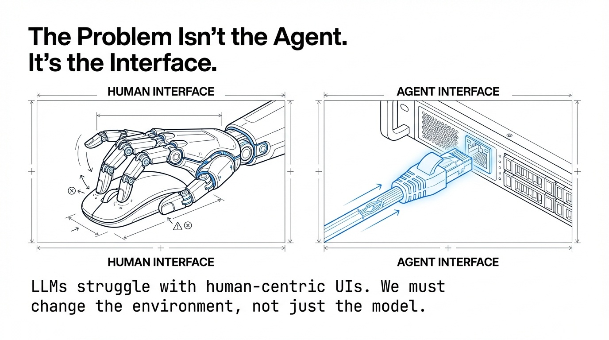
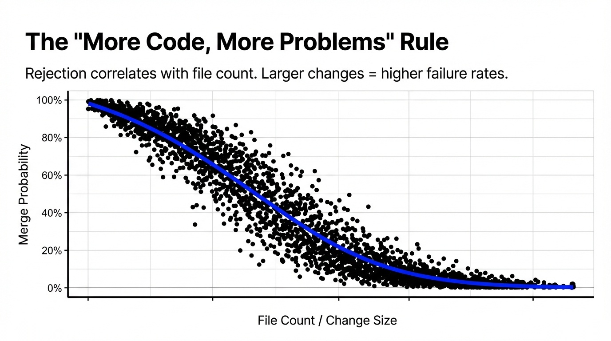
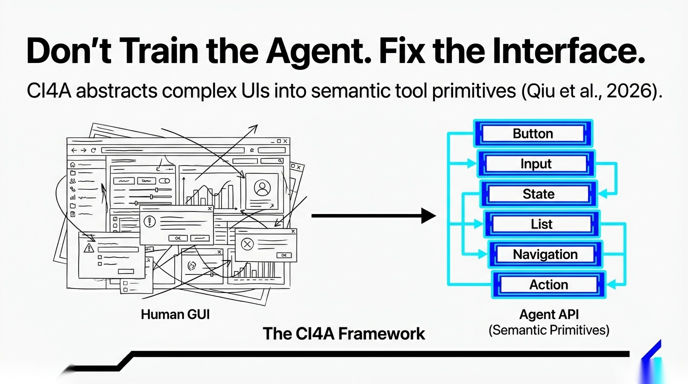
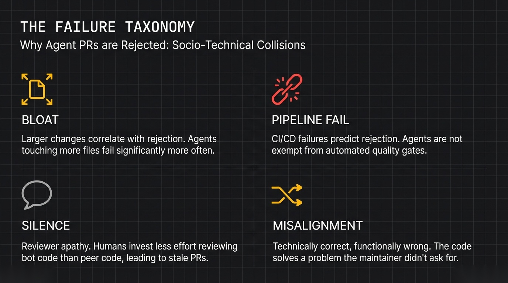
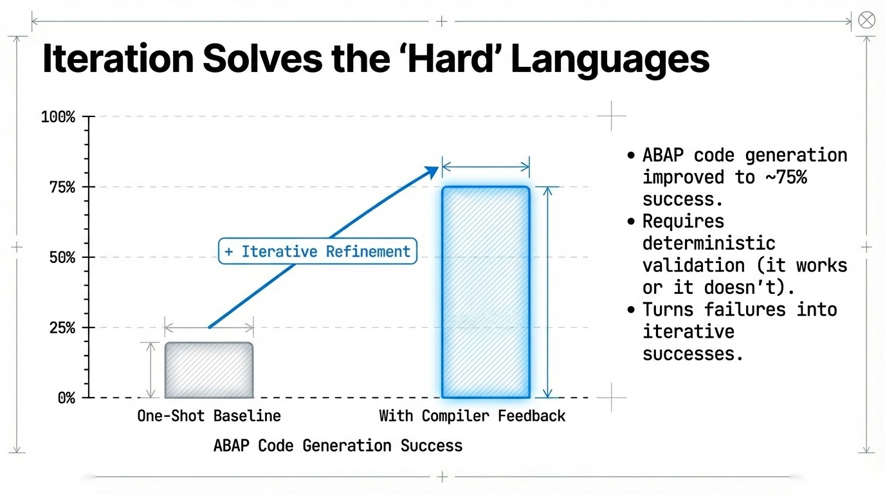

# The Future of AI Coding Agents

## Lessons from 33,000 Agentic Pull Requests

**A Technical White Paper on Code Generation Success Patterns, Failure Taxonomies, and Enterprise Integration Strategies**

---

**Author**: Tahir Yamin, Senior Researcher  
**Date**: January 2026  
**Research Source**: arXiv cs.AI Recent Publications  
**Classification**: Research/Technical White Paper

---

## Executive Summary

AI agents are writing production code. Not just suggesting snippets—submitting pull requests, responding to reviews, attempting to merge changes into real codebases.

The results are mixed. And now we have data to understand why.

Research examining **33,000 agent-authored pull requests** across GitHub reveals patterns that should inform every organization considering agentic code generation. The findings challenge assumptions about where agents succeed, why they fail, and what human-AI collaboration in software development actually looks like.

**Key findings:**

- Documentation, CI, and build tasks achieve highest merge rates; performance and bug-fix tasks perform worst
- Larger code changes correlate with rejection; agents that touch more files fail more often
- 86.3% task success is achievable with proper interface design (CI4A framework)
- Compiler feedback loops improve ABAP code generation by 75% through iterative refinement

---

## The Agent PR Landscape

AI coding agents are no longer hypothetical. They're active. They're submitting PRs. And they're getting rejected.

Research from Ehsani et al. (2026) conducted the first large-scale study of agent-authored PRs in the wild—33,000 submissions from five coding agents across actual GitHub repositories.

What they found upends some assumptions about how these systems perform.

### What Gets Merged

Not all tasks are equal. The research reveals clear patterns in merge success by task type:

**High merge rates:**
- Documentation updates
- CI/CD configuration
- Build system changes

**Low merge rates:**
- Performance optimization
- Bug fixes

This makes sense when you think about it. Documentation is relatively isolated—mistakes don't break things. CI and build changes are testable—you know quickly if they work. Performance optimization requires understanding system behavior that agents can't observe. Bug fixes require diagnosing root causes in complex systems.

### What Doesn't Get Merged

The quantitative analysis reveals structural patterns in rejected PRs:

1. **Larger code changes correlate with rejection**. Agents that produce more code, touch more files, and make bigger structural changes fail more often.

2. **CI/CD pipeline failures predict rejection**. PRs that don't pass automated validation rarely get merged—agents aren't exempt from the same quality gates as humans.

3. **Review dynamics differ from human PRs**. Agent submissions often receive less meaningful reviewer engagement, suggesting humans don't invest the same effort reviewing AI code as peer code.

### Why PRs Actually Fail

The quantitative patterns tell part of the story. Qualitative analysis of 600 rejected PRs reveals the deeper reasons:

**Lack of meaningful reviewer engagement**: Many agent PRs are ignored rather than actively rejected. Reviewers don't invest time understanding or improving them.

**Duplicate PRs**: Agents sometimes submit multiple attempts at the same problem, cluttering the review queue.

**Unwanted feature implementations**: Agents occasionally "solve" problems repository maintainers didn't ask to be solved.

**Agent misalignment**: The implemented solution doesn't match what was actually needed—technically correct code that misses the point.

These aren't purely technical failures. They're socio-technical failures at the intersection of agent capability and human process.

*Figure 1: PR Success Rates by Task Type. Analysis from Ehsani et al. (2026) showing the sharp divergence between well-defined tasks (Documentation, Build) which see >80% merge rates, and complex reasoning tasks (Performance, Bug Fixes) which drop below 30%.*

---

## Interface Design Matters: The CI4A Breakthrough

If agents struggle with complex, unstructured tasks, what about well-structured ones?

Research from Qiu et al. (2026) demonstrates that interface design dramatically affects agent success rates.

### The Problem with Human-Centric Interfaces

LLMs demonstrate remarkable proficiency in high-level semantic planning. They understand what to do. But they remain limited in fine-grained, low-level web component manipulations. They struggle with *how* to do it.

Previous research focused on enhancing model grounding—training agents to handle complex interfaces through reinforcement learning. Make the agent smarter.

The CI4A researchers asked a different question: what if we made the interface more agent-friendly?

### Component Interface for Agent (CI4A)

CI4A is a semantic encapsulation mechanism that abstracts complex UI interaction logic into unified tool primitives.

Rather than forcing agents to navigate complex web interfaces designed for humans—clicking through menus, handling mouse events, managing state—CI4A exposes clean, semantic APIs.

The researchers implemented CI4A within Ant Design, an industrial-grade front-end framework, covering 23 categories of commonly used UI components.

### The Results

CI4A-based agents achieve **86.3% task success rate** on the WebArena benchmark—a new state-of-the-art that significantly outperforms existing approaches.

Beyond accuracy, execution efficiency improves substantially. Agents accomplish tasks faster when they don't have to fumble through human-centric interfaces.

### The Implication

The takeaway isn't just about web automation. It's about interface philosophy.

*Figure 3: The CI4A Architecture from Qiu et al. (2026). The diagram shows the transformation of raw HTML DOM elements into semantic "Agent Primitives." This abstraction layer allows agents to interact with logical components (Buttons, Cards, Forms) rather than fragile CSS selectors.*

When we design systems for AI agents, we have a choice: force agents to adapt to human interfaces, or build interfaces optimized for agent interaction.

The research suggests the second approach is dramatically more effective. Rather than endlessly refining agent capabilities, we might better invest in agent-friendly abstractions.

---

## Iterative Refinement: The ABAP Case Study

Code generation doesn't end at first output. What happens when we give agents feedback?

Research from Wallraven et al. (2026) examines LLM performance on ABAP code generation—SAP's proprietary programming language—with and without iterative refinement based on compiler feedback.

### The Baseline Struggle

ABAP is challenging for LLMs. Limited training data compared to mainstream languages. Complex enterprise semantics. Strict syntax requirements.

Initial benchmarks showed significant performance variation across models. Powerful LLMs achieved reasonable success rates; smaller models struggled substantially.

### Compiler Feedback Changes Everything

The key finding: **iterative improvement using compiler feedback dramatically improves outcomes**.

When agents can attempt code generation, receive syntax errors, and retry, success rates climb. The best models achieve around 75% success after several iterations—up from much lower initial rates.

### What Makes Feedback Effective

Not all feedback is equally useful. Compiler output provides:

1. **Precise error localization**: Unlike vague human feedback ("this doesn't look right"), compilers identify exact line numbers and error types.

2. **Deterministic correctness signals**: Code either compiles or doesn't. No ambiguity about success.

3. **Immediate iteration**: Agents can retry instantly without waiting for human review.

This stands in contrast to typical code review feedback, which may be slow, imprecise, and subjective. Compiler feedback enables tight, deterministic refinement loops.

### Broader Applications

The ABAP study generalizes. Any domain with:
- Deterministic validation (compilers, tests, type checkers)
- Precise error messages
- Ability to iterate quickly

...can benefit from feedback-driven agent improvement.

This suggests an architecture: initial generation, automated validation, iterative refinement, human review of validated output. Agents handle the try-fix cycle; humans evaluate the result.

*Figure 2: Impact of Compiler Feedback on ABAP Generation. Data from Wallraven et al. (2026) illustrates the "Iterative Refinement Gap"—the dramatic performance jump (from <20% to ~75%) when agents are allowed to loop against a deterministic compiler before human review.*

---

## Evolutionary Optimization: PhyloEvolve

Beyond single-iteration refinement, what about systematic optimization over many generations?

Research from Zhao et al. (2026) on PhyloEvolve demonstrates LLM-agent systems for GPU-oriented algorithm optimization through evolutionary approaches.

### The Challenge

Optimizing scientific computing algorithms for modern GPUs is labor-intensive. It involves:
- Repeated code modification
- Benchmarking across hardware configurations
- Tuning across complex software stacks

Traditional approaches require human expertise guiding iterative optimization. But humans are slow, expensive, and struggle to explore large solution spaces.

### The Phylogenetic Approach

PhyloEvolve reframes optimization as In-Context Reinforcement Learning. Rather than training models to optimize code, it uses trajectory-conditioned reasoning—learning from optimization *histories*.

The key innovation: organizing optimization history as a phylogenetic tree that captures inheritance, divergence, and recombination among algorithm variants.

This enables:
- **Backtracking**: When a line of development fails, return to earlier successful variants
- **Cross-lineage transfer**: Combine insights from different optimization branches
- **Reproducibility**: Every variant's ancestry is tracked

*Figure 4: The PhyloEvolve Optimization Process. Visualizing the "Phylogenetic Tree" of code variants. The system branches new optimization attempts from successful parents, backtracking when performance degrades, mirroring biological evolution to navigate the complex landscape of GPU kernel optimization.*

### Results

On scientific computing workloads—PDE solvers, manifold learning, spectral graph algorithms—PhyloEvolve consistently improves runtime, memory efficiency, and correctness over baseline methods.

### Implications for Code Agents

PhyloEvolve suggests a paradigm: code agents shouldn't just generate and hope. They should *explore* systematically.

Version control already supports this philosophy for humans. PhyloEvolve applies it to agents—treating optimization as navigation through a space of possibilities rather than one-shot generation.

---

## Synthesis: The Coding Agent Success Pattern

What patterns emerge across this research?

### Where Agents Succeed

1. **Well-defined, isolated tasks**: Documentation, CI/CD, interfaces with clear specifications
2. **Deterministic validation**: Compilers, type checkers, test suites that provide precise feedback
3. **Agent-optimized interfaces**: Clean APIs rather than human UI navigation
4. **Iterative refinement**: Multiple attempts with feedback rather than one-shot generation

### Where Agents Fail

1. **Complex, cross-cutting concerns**: Performance optimization, deep bug fixes requiring system understanding
2. **Socio-technical contexts**: Requirements interpretation, stakeholder alignment, review engagement
3. **Large change sets**: More files touched = higher rejection probability
4. **Novel problem domains**: Tasks outside training distribution

### The Integration Model

Successful agent deployment isn't about replacing human developers. It's about redesigning development workflows for human-agent collaboration.

Key principles:
- **Agent-appropriate task selection**: Route well-defined, testable tasks to agents
- **Deterministic validation gates**: Let agents iterate against compilers and tests before human review
- **Interface optimization**: Build agent-friendly abstractions for agent tasks
- **Human judgment for ambiguity**: Keep requirements interpretation and design decisions with humans

*Figure 5: The Integrated Success Pattern. Synthesized from Ehsani et al.’s findings, this model illustrates the "Goldilocks Zone" for coding agents: tasks with medium conceptual complexity but high validation determinism, mediated by agent-aware interfaces.*

---

## Recommendations for Engineering Organizations

### Immediate Actions

1. **Audit your task portfolio**. Which tasks are well-defined, isolated, and testable? These are your agent opportunities. Which require context, judgment, and cross-system understanding? Keep these human.

2. **Invest in validation infrastructure**. Agents improve dramatically with deterministic feedback. Comprehensive test suites, type systems, and CI pipelines become even more valuable in agentic workflows.

3. **Design for agent interaction**. When building internal tools and APIs, consider agent usability. Clean abstractions help agents as much as humans—maybe more.

### Medium-Term Investments

4. **Build iterative refinement loops**. Don't evaluate agent output on first attempt. Build workflows where agents can try, fail, learn, and retry before human review.

5. **Develop agent-specific review processes**. Human review of agent code differs from peer review. Consider dedicated workflows with appropriate expectations and tooling.

6. **Experiment with evolutionary approaches**. For optimization tasks, systematic exploration may outperform single-shot generation. Consider tools like PhyloEvolve for appropriate workloads.

### Strategic Considerations

7. **Expect socio-technical challenges**. Agent integration isn't purely technical. Review dynamics, trust calibration, and process adaptation all matter. Plan for organizational change management.

8. **Match expectations to reality**. Agents won't replace developers—but they will change development workflows. Communicate accurately about capabilities and limitations.

---

## Conclusion

AI coding agents are real, active, and impactful. The research reviewed here provides the first rigorous look at how they actually perform.

The news is mixed but instructive. Agents succeed at well-defined tasks with deterministic validation and agent-friendly interfaces. They struggle with complex, ambiguous, cross-cutting concerns that require system understanding and human judgment.

The path forward isn't about making agents smarter—though that helps. It's about redesigning workflows, building appropriate interfaces, and recognizing what humans and agents each do well.

The 33,000 PR study reveals something important: most agent PRs fail not because of technical inadequacy but because of integration failures—wrong tasks, wrong interfaces, wrong review processes.

Organizations that succeed with coding agents will be those that redesign for human-agent collaboration rather than hoping agents fit existing processes.

The code is being written. The question is whether we'll learn the right lessons from it.

---

## References

1. Ehsani, R., Pathak, S., Rawal, S., et al. (2026). Where Do AI Coding Agents Fail? An Empirical Study of Failed Agentic Pull Requests in GitHub. *arXiv:2601.15195*

2. Qiu, Z., Sun, J., Xia, C., et al. (2026). CI4A: Semantic Component Interfaces for Agents Empowering Web Automation. *arXiv:2601.14790*

3. Wallraven, S., Köhne, T., Westenberger, H., & Moser, A. (2026). Benchmarking Large Language Models for ABAP Code Generation: Iterative Improvement by Compiler Feedback. *arXiv:2601.15188*

4. Zhao, L., Huang, W., Guo, Y., et al. (2026). Large Language Model-Powered Evolutionary Code Optimization on a Phylogenetic Tree. *arXiv:2601.14523*

---

**About the Author**: Tahir Yamin is a Senior Researcher and Technical Writer specializing in AI systems, software engineering, and developer tools.

---

*© 2026 Tahir Yamin. All rights reserved.*
