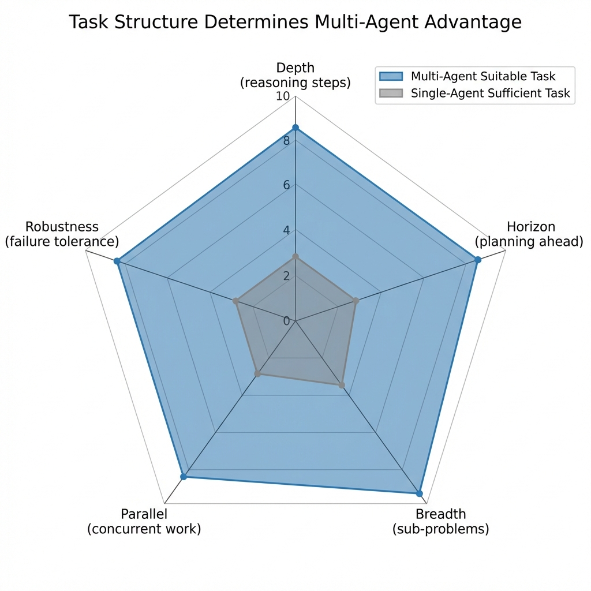
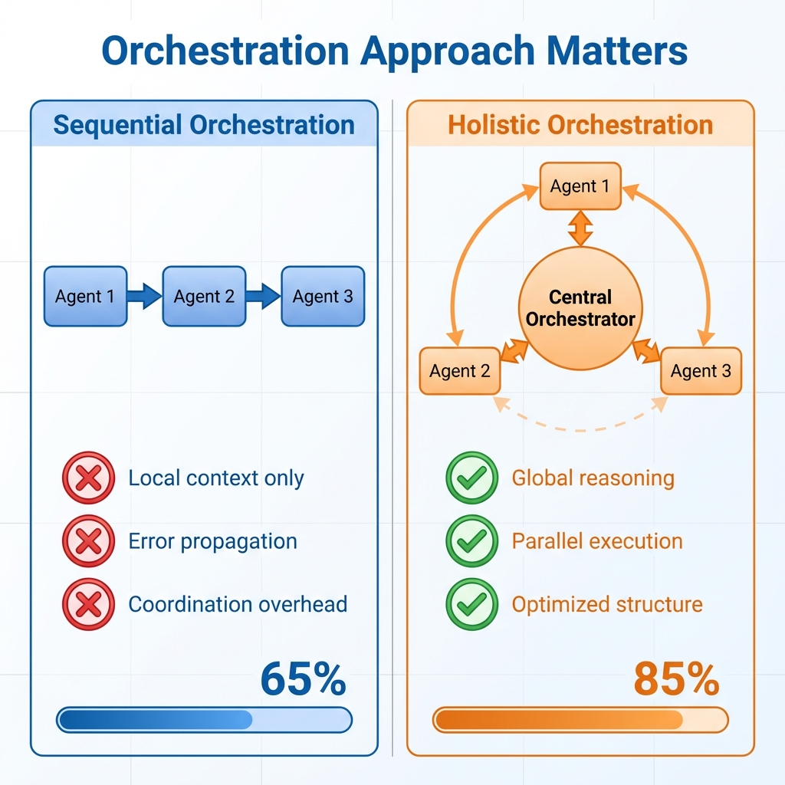
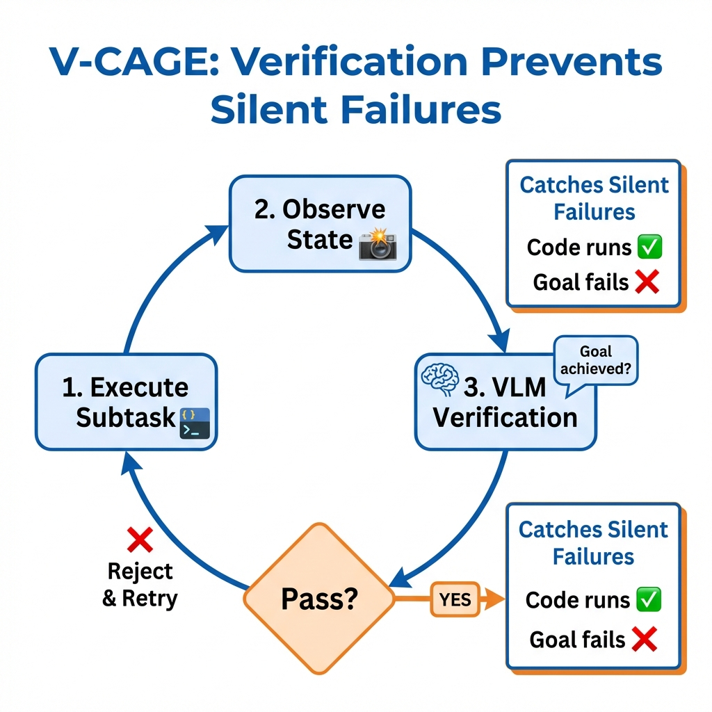

# Multi-Agent Systems: Promise vs. Reality

## When Collaboration Helps, When It Harms, and How to Tell the Difference

**A Technical White Paper on Agent Orchestration, Task Structure Dependencies, and the True Conditions for Multi-Agent Advantage**

---

**Author**: Tahir Yamin, Senior Researcher  
**Date**: January 2026  
**Research Source**: arXiv cs.AI Recent Publications  
**Classification**: Research/Technical White Paper

---

## Executive Summary

Multi-agent systems have captured the AI community's imagination. If one agent is powerful, surely many agents collaborating must be more powerful still?

Not necessarily.

Research published this month introduces rigorous analysis of when multi-agent systems actually outperform single-agent approaches—and the conditions are far more specific than enthusiasts suggest.

This paper synthesizes three key research papers to provide evidence-based guidance on multi-agent deployment. The findings will disappoint those hoping for universal multi-agent superiority, but they'll serve those who want systems that actually work.

**Key findings:**

- MAS gains depend critically on **task structure**, not agent count
- Five task dimensions predict multi-agent advantage: Depth, Horizon, Breadth, Parallel, Robustness
- Holistic orchestration outperforms sequential execution for complex coordination
- VLM verification loops filter "silent failures" where code executes but goals fail

---

## The Multi-Agent Promise

The appeal of multi-agent systems is intuitive. Complex problems benefit from multiple perspectives. Specialized agents can divide labor. Collaboration surfaces insights no single agent would reach.

Investment follows intuition. Multi-agent frameworks proliferate. Startups raise funding on agentic swarm visions. Enterprises experiment with agent orchestration platforms.

But does any of this work? Does adding agents actually improve outcomes?

Research from Ke et al. (2026) on MAS-Orchestra provides the most rigorous analysis to date—and the answer is: **it depends, in very specific ways**.

---

## When Multi-Agent Helps: The Task Structure Thesis

MAS-Orchestra introduces something the field needed: controlled benchmarks that characterize *why* multi-agent systems succeed or fail.

### The Five Task Dimensions

The researchers identify five axes that predict multi-agent advantage:

**Depth**: How many reasoning steps from input to output? Shallow tasks benefit less from agent collaboration than deep multi-hop reasoning.

**Horizon**: How far ahead must agents plan? Short-horizon tasks can be solved greedily; long-horizon tasks benefit from coordinated planning.

**Breadth**: How many independent sub-problems exist? Parallelizable tasks with independent components suit multi-agent decomposition.

**Parallel**: Can sub-agents work simultaneously? Tasks with sequential dependencies limit parallelization benefits.

**Robustness**: How resilient is the system to individual agent failures? Complex tasks may require redundancy that multi-agent architectures provide.

### The Key Insight

Here's what matters most: **MAS gains depend critically on task structure, not on adding more agents**.

Some tasks are genuinely multi-agent-friendly. They have depth, horizon, breadth, and parallelism that reward decomposition. For these tasks, well-orchestrated multi-agent systems outperform single-agent approaches.

Other tasks don't have this structure. They're fundamentally sequential, shallow, or holistically integrated. Adding agents adds overhead without benefit—or actively harms through coordination failures.

The research reveals that many practitioners have been asking "how do we build better multi-agent systems?" when they should ask "is a multi-agent system appropriate for this task?"

---

## Orchestration Matters: Sequential vs. Holistic

Even for appropriate tasks, orchestration approach significantly affects outcomes.

### The Sequential Limitation

Current multi-agent design often uses sequential, code-level execution. Agent 1 runs, produces output, hands off to Agent 2, and so on.

This creates problems:
- **No global reasoning**: Each agent sees only its local context
- **Error propagation**: Mistakes compound through the chain
- **Coordination overhead**: Handoff logic becomes complex
- **Scaling difficulties**: Adding agents means more handoffs

### Holistic Orchestration

MAS-Orchestra proposes an alternative: formulate orchestration as a function-calling reinforcement learning problem where the entire multi-agent system is generated at once.

Complex sub-agents are abstracted as callable functions. The orchestrator reasons globally over system structure while hiding internal execution details.

This enables:
- **Global optimization**: The orchestrator sees the whole problem
- **Structural flexibility**: Agent composition adapts to task requirements
- **Reduced coordination overhead**: No sequential handoff chains
- **Easier verification**: Outputs can be validated against inputs without tracing through chains

### The Results

MAS-Orchestra achieves consistent improvements on public benchmarks:
- Mathematical reasoning
- Multi-hop question answering
- Search-based QA

The gains come not from more agents but from better orchestration—generating appropriate multi-agent structures for specific tasks rather than applying fixed templates.

---

## The Verification Problem

Multi-agent systems face a challenge single agents don't: ensuring that complex, multi-step processes actually achieve intended goals.

Research from Liu et al. (2026) on V-CAGE addresses this for embodied AI—long-horizon manipulation tasks where agents must coordinate actions over time.

### Silent Failures

The key problem: code can execute successfully while completely failing to achieve the task goal.

In embodied AI scenarios:
- Objects get placed in physically impossible configurations
- Action sequences "complete" without achieving the semantic objective
- Language-driven programs report success without satisfying task constraints

Standard execution monitoring misses these failures. The code ran. No errors occurred. But the goal wasn't achieved.

### VLM Verification Loops

V-CAGE introduces vision-language model critics that perform **rejection sampling after each subtask**.

Rather than trusting execution reports, the system:
1. Executes the subtask
2. Observes the resulting state visually
3. Asks a VLM: "Does this state achieve the intended goal?"
4. Rejects and retries if verification fails

This catches silent failures that pure execution monitoring misses.

### Context-Aware Instantiation

Beyond verification, V-CAGE addresses scene setup—ensuring that generated scenarios are physically plausible before agents even begin.

A context-aware instantiation mechanism dynamically maintains a map of prohibited spatial areas as objects are placed. This prevents interpenetration and ensures reachable, conflict-free configurations.

The result: synthetic datasets with superior physical and semantic fidelity, producing better downstream policies than non-verified baselines.

---

## Solving Information Collapse in Robotics

The third research thread addresses a specific but important multi-agent challenge: vision-language-action models for robot manipulation.

Research from Lian et al. (2026) on BayesianVLA identifies a critical pathology they call **Information Collapse**.

### The Problem

In robot manipulation, training data often comes from goal-driven collection. Robots attempt tasks, and datasets record successful trajectories.

But this creates bias: language instructions become highly predictable from visual observations alone. If you see a cup on a table and a robot arm, you can guess "pick up the cup" without reading the instruction.

The consequence? Models learn to ignore language entirely. They degenerate into vision-only policies that work in training but fail when instructions vary.

### The Bayesian Solution

BayesianVLA introduces a dual-branch architecture:
- One branch estimates Conditional **vision-only prior** p(action | vision)
- One branch estimates **language-conditioned posterior** π(action | vision, language)

The training objective maximizes conditional Pointwise Mutual Information between actions and instructions. This penalizes the "vision shortcut" and rewards actions that genuinely depend on language.

### Results

Without requiring new data collection, BayesianVLA achieves:
- 11.3% improvement on challenging OOD benchmarks
- Better generalization to new instructions
- More reliable grounding of language in action

The approach works because it addresses the information-theoretic structure of the problem—ensuring that language provides signal beyond what vision alone offers.

---

## Synthesis: The Multi-Agent Decision Framework

What emerges from this research is a framework for deciding when and how to deploy multi-agent systems.

### Decision 1: Is Multi-Agent Appropriate?

Evaluate your task on the five dimensions:

| Dimension | Multi-Agent Favored | Single-Agent Sufficient |
|-----------|---------------------|-------------------------|
| Depth | Deep reasoning chains | Shallow inference |
| Horizon | Long-term planning | Immediate decisions |
| Breadth | Many independent sub-problems | Holistically integrated |
| Parallel | Concurrent execution possible | Sequential dependencies |
| Robustness | Failure tolerance needed | Single point sufficient |

If your task scores high on multiple dimensions, multi-agent may offer advantages. If it doesn't, additional agents add overhead without benefit.

### Decision 2: How to Orchestrate?

If multi-agent is appropriate, consider orchestration approach:

**Sequential execution** works for:
- Simple task decomposition
- Clear handoff semantics
- Limited agent interdependence

**Holistic orchestration** works for:
- Complex coordination requirements
- Need for global optimization
- Variable agent compositions

### Decision 3: How to Verify?

Multi-agent systems need verification beyond single-agent approaches:

**Execution monitoring** catches obvious failures—crashes, exceptions, timeouts.

**VLM verification** catches semantic failures—executed correctly but goal not achieved.

**Constraint enforcement** prevents failures upfront—physical plausibility, logical consistency.

---

## Recommendations

### For New Multi-Agent Projects

1. **Start with task analysis**. Characterize your problem on the five dimensions before choosing architectures. Don't assume multi-agent is better.

2. **Benchmark against single-agent baselines**. Any multi-agent system should demonstrably outperform a well-tuned single agent on your specific task. If it doesn't, simplify.

3. **Invest in verification**. Multi-agent systems fail in ways that are hard to detect. Build verification infrastructure before you need it.

### For Existing Multi-Agent Systems

4. **Audit orchestration overhead**. How much complexity serves coordination rather than task completion? Consider holistic approaches if sequential handoffs dominate.

5. **Identify failure modes**. What kinds of failures occur? Silent semantic failures need visual verification. Coordination failures need structural redesign.

6. **Measure true performance**. Aggregate success metrics hide coordination costs. Understand where value is actually created.

### For Research and Development

7. **Develop controlled benchmarks**. The field needs more work like MASBENCH—benchmarks that isolate task properties affecting multi-agent advantage.

8. **Study orchestration systematically**. How agents coordinate matters as much as agent capability. More research on orchestration algorithms is needed.

---

## Conclusion

Multi-agent AI is neither panacea nor hype—it's a tool with specific conditions for advantage.

The research reviewed here provides the clearest picture yet of those conditions. Task structure predicts multi-agent benefits. Orchestration approach determines whether benefits are realized. Verification catches failures that multi-agent complexity introduces.

Organizations that succeed with multi-agent systems will be those that start with task analysis, choose architectures deliberately, and invest in verification. Those that assume more agents means better outcomes will find the opposite.

The promise of multi-agent AI is real—but it's conditional on understanding when that promise applies.

---

## References

1. Ke, Z., Ming, Y., Xu, A., et al. (2026). MAS-Orchestra: Understanding and Improving Multi-Agent Reasoning Through Holistic Orchestration and Controlled Benchmarks. *arXiv:2601.14652*

2. Liu, Y., Wang, A., Ye, N. (2026). V-CAGE: Context-Aware Generation and Verification for Scalable Long-Horizon Embodied Tasks. *arXiv:2601.15164*

3. Lian, S., Yu, B., Lin, X., et al. (2026). BayesianVLA: Bayesian Decomposition of Vision Language Action Models via Latent Action Queries. *arXiv:2601.15197*

---

**About the Author**: Tahir Yamin is a Senior Researcher and Technical Writer specializing in AI systems, multi-agent architectures, and enterprise technology deployment.

---

*© 2026 Tahir Yamin. All rights reserved.*
